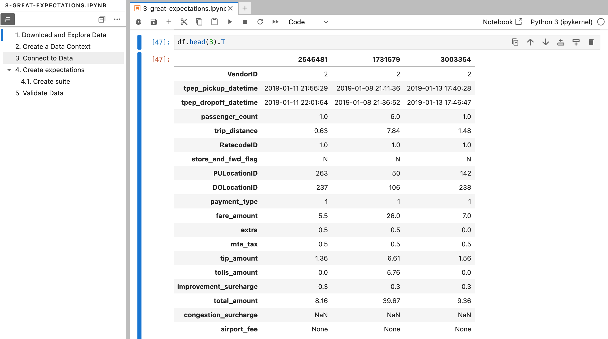

# 🚀 Tutorial: Comprehensive ML Monitoring for Modern AI and MLOps

## 👀 Overview

🎓 **What is this?** Welcome to "Comprehensive ML Monitoring for Modern AI and MLOps." This tutorial is your guide to navigating the critical world of monitoring ML models and data. We'll explore key concepts and introduce popular open-source tools: **Evidently AI**, **Great Expectations**, and **Grafana**.

👩‍💻 **Who is this tutorial for?** If you're a Data Scientist, AI Developer, or ML Engineer aiming to build robust and reliable machine learning systems, this tutorial is for you. We'll cover foundational principles and practical applications.

🎯 **What will you learn in this tutorial?**

- The essential tasks and strategies for effective ML monitoring in an MLOps context.
- Setting up model performance and data quality monitoring with Evidently AI.
- Implementing data validation and quality checks using Great Expectations.
- Visualizing crucial monitoring metrics with Grafana dashboards.
- Integrating monitoring insights with MLOps tools like MLflow.

🔍 **How is it structured?** Through clear, step-by-step instructions with illustrative code examples (provided in accompanying notebooks) in Markdown format.

⏱️ **How much time will it take?** Approximately **60-90 minutes** to cover the concepts and tool introductions, with additional time if you run all code examples thoroughly.

---

## 📖 Table of Contents

- [🚀 Tutorial: Comprehensive ML Monitoring for Modern AI and MLOps](#-tutorial-comprehensive-ml-monitoring-for-modern-ai-and-mlops)
  - [👀 Overview](#-overview)
  - [📖 Table of Contents](#-table-of-contents)
  - [⚙️ 1 - Prerequisites & Setup](#️-1---prerequisites--setup)
- [🛠️ 2 - ML Monitoring: Core Tasks and Tools in MLOps](#️-2---ml-monitoring-core-tasks-and-tools-in-mlops)
  - [Essential Monitoring Layers in ML Systems](#essential-monitoring-layers-in-ml-systems)
  - [Popular Open-Source Tools for ML Monitoring](#popular-open-source-tools-for-ml-monitoring)
- [🏎️ 3 - Evidently AI: Generating Model & Data Quality Insights](#️-3---evidently-ai-generating-model--data-quality-insights)
  - [Step 1: Import Evidently AI and Dependencies](#step-1-import-evidently-ai-and-dependencies)
  - [Step 2: Prepare Your Data (Reference vs. Current)](#step-2-prepare-your-data-reference-vs-current)
  - [Step 3: Generate Data Drift Reports](#step-3-generate-data-drift-reports)
  - [Step 4: Customize and Save Reports](#step-4-customize-and-save-reports)
- [🤝 4 - Integrating Evidently AI with MLflow for Model Monitoring](#-4---integrating-evidently-ai-with-mlflow-for-model-monitoring)
  - [Step 1: Load Data](#step-1-load-data)
  - [Step 2: Define Data Structure (Column Mapping)](#step-2-define-data-structure-column-mapping)
  - [Step 3: Train a Simple Model](#step-3-train-a-simple-model)
  - [Step 4: Prepare Reference Dataset](#step-4-prepare-reference-dataset)
  - [Step 5: Prepare Current Dataset](#step-5-prepare-current-dataset)
  - [Step 6: Generate a Model Quality Report with Evidently AI](#step-6-generate-a-model-quality-report-with-evidently-ai)
  - [Step 7: Extract Key Metrics from the Evidently AI Report](#step-7-extract-key-metrics-from-the-evidently-ai-report)
  - [Step 8: Log Reports and Metrics to MLflow](#step-8-log-reports-and-metrics-to-mlflow)
- [🎱 5 - Data Validation with Great Expectations (GX)](#-5---data-validation-with-great-expectations-gx)
  - [Step 1: Load Data](#step-1-load-data-1)
  - [Step 2: Initialize a GX Data Context](#step-2-initialize-a-gx-data-context)
  - [Step 3: Connect Data and Create a Validator](#step-3-connect-data-and-create-a-validator)
  - [Step 4: Define Expectations about Your Data](#step-4-define-expectations-about-your-data)
  - [Step 5: Save an Expectation Suite](#step-5-save-an-expectation-suite)
  - [Step 6: Validate New Data using a Checkpoint](#step-6-validate-new-data-using-a-checkpoint)
- [📊 6 - Visualizing ML Metrics with Grafana and PostgreSQL](#-6---visualizing-ml-metrics-with-grafana-and-postgresql)
  - [Step 1: Launch Grafana and PostgreSQL](#step-1-launch-grafana-and-postgresql)
  - [Step 2: Calculate Monitoring Metrics (Using Evidently AI)](#step-2-calculate-monitoring-metrics-using-evidently-ai)
  - [Step 3: Prepare the PostgreSQL Monitoring Database](#step-3-prepare-the-postgresql-monitoring-database)
  - [Step 4: Log Model Quality Metrics to PostgreSQL](#step-4-log-model-quality-metrics-to-postgresql)
  - [Step 5: Explore the Pre-configured Grafana Dashboard](#step-5-explore-the-pre-configured-grafana-dashboard)
  - [Step 6: Customize Grafana Panels (Exercise)](#step-6-customize-grafana-panels-exercise)
- [🔗 7 - Additional Resources](#-7---additional-resources)
- [🎉 8 - Next Steps & Conclusion](#-8---next-steps--conclusion)

---

## ⚙️ 1 - Prerequisites & Setup

This section guides you through setting up the environment for the ML monitoring tutorial.

**0. Prerequisites:**

- Python 3.9+ installed.
- `uv` (or `pip`) for Python package management.
- Git for cloning the repository.
- Docker and Docker Compose installed.
- Basic understanding of Python, pandas, and machine learning concepts.
- Familiarity with the command line/terminal.

> 💡 **Project Structure:** For this tutorial, assume a project structure where `data/`, `src/`, `notebooks/`, and `gx/` (created by Great Expectations) directories reside at the project root or are clearly referenced.

**1. Fork / Clone this Repository**

```bash
git clone https://gitlab.com/risomaschool/tutorials-raif/monitoring-1-get-started.git # Or your updated repo URL
cd monitoring-1-get-started
```

**2. Create Virtual Environment & Install Dependencies**

```bash
# Using uv (recommended)
uv venv .venv --python 3.9
echo "export PYTHONPATH=\$PWD" >> .venv/bin/activate # Add project root to PYTHONPATH
source .venv/bin/activate
uv pip install --upgrade pip setuptools wheel
uv pip install -r requirements.txt
```

> 👉 **Note on `PYTHONPATH`**: Adding the project root to `PYTHONPATH` helps Python find your custom modules (e.g., in `src/`) when running scripts or notebooks.

**3. Download Datasets**

   1. Bike Sharing Dataset:

       ```bash
       python src/load_data.py
       ```

   2. NYC Yellow Taxi Trip Records (Jan 2019):

       ```bash
       mkdir -p data # Ensure 'data' directory exists
       wget https://d37ci6vzurychx.cloudfront.net/trip-data/yellow_tripdata_2019-01.parquet -O data/yellow_tripdata_2019-01.parquet
       ```

**4. Start MLflow UI**

```bash
mlflow ui
```

Access at `http://localhost:5000`.

**5. Start Docker Services (Grafana & PostgreSQL)**

```bash
docker compose up -d
```

Access Grafana UI at `http://localhost:3000` (login: `admin`/`admin`).

**6. Launch Jupyter Lab or Jupyter Notebook**

```bash
jupyter lab
```

---

## 🛠️ 2 - ML Monitoring: Core Tasks and Tools in MLOps

Effective ML monitoring is a cornerstone of robust MLOps practices, ensuring models perform reliably and deliver value over time.

### Essential Monitoring Layers in ML Systems

Monitoring an ML system involves observing several interconnected layers:

1. **🖥️ System Health & Performance:**
    - *Focus:* Backend infrastructure, API responsiveness.
    - *Metrics:* Prediction service latency, error rates, uptime, resource (CPU/memory) usage.
2. **💾 Data Integrity & Quality:**
    - *Focus:* Validity and statistical properties of input data for inference and retraining.
    - *Key Concerns:* **Data Drift** (changes in feature distributions), schema violations, missing values, outliers.
    - *MLOps Link:* Data issues often trigger alerts for data pipeline reviews or retraining. Feature Stores can help maintain consistency.
3. **🧠 ML Model Performance:**
    - *Focus:* The model's predictive power and behavior in production.
    - *Key Concerns:* **Prediction Drift** (changes in output distribution), **Concept Drift** (changes in feature-target relationships), degradation of accuracy metrics (e.g., F1, MAE), model staleness, fairness, and bias.
    - *MLOps Link:* Performance drops often initiate automated retraining workflows or investigation into data changes.
4. **📈 Business or Product KPIs:**
    - *Focus:* The model's impact on overarching business objectives.
    - *Metrics:* Click-through rates, conversion, revenue impact, user engagement, operational efficiency gains.
    - *MLOps Link:* Demonstrates the ROI of ML initiatives and guides strategic decisions.


*Source: [Evidently AI Blog - ML Monitoring Metrics](https://www.evidentlyai.com/blog/ml-monitoring-metrics)*

These layers are not isolated. For example, a drop in a business KPI (Layer 4) might be traced back to model performance degradation (Layer 3), caused by data drift (Layer 2), due to an issue in a data ingestion service (Layer 1). This holistic view is central to **ML Observability**.

### Popular Open-Source Tools for ML Monitoring


This tutorial explores:

- **Evidently AI:** For comprehensive model/data drift analysis and quality reporting.
- **Great Expectations (GX):** For robust data validation and quality assertions ("Expectations").
- **Grafana & PostgreSQL:** For custom, time-series visualization of ML metrics.
- **MLflow:** For logging monitoring artifacts and metrics alongside experiment tracking.

---

## 🏎️ 3 - Evidently AI: Generating Model & Data Quality Insights

> 💡 **Open the example notebook:** `notebooks/1-getting-started-evidently.ipynb`

**Evidently AI** calculates a wide array of metrics for data and ML models, presenting them in interactive HTML reports or JSON snapshots. This is invaluable for debugging, validation, and ongoing monitoring.


### Step 1: Import Evidently AI and Dependencies

```python
import pandas as pd
import numpy as np

from sklearn.datasets import fetch_california_housing

from evidently import ColumnMapping
from evidently.report import Report
from evidently.metric_preset import DataDriftPreset, TargetDriftPreset
from evidently.metrics import ColumnSummaryMetric, ColumnQuantileMetric, ColumnDriftMetric
```

### Step 2: Prepare Your Data (Reference vs. Current)

Evidently AI compares a `current` dataset (e.g., recent production data) against a `reference` dataset (e.g., training data or a stable production period).

```python
# Load and prepare California Housing data
data_bunch = fetch_california_housing(as_frame=True)
housing_df = data_bunch.frame
housing_df.rename(columns={'MedHouseVal': 'target'}, inplace=True)
# Create a slightly noisy prediction for demonstration
housing_df['prediction'] = housing_df['target'].values + np.random.normal(0, 0.5, housing_df.shape[0])

reference_df = housing_df.sample(n=5000, random_state=42, replace=False)
current_df = housing_df.sample(n=5000, random_state=101, replace=False)
```


> 💡 **ColumnMapping:** Explicitly use `ColumnMapping` to define roles of columns (target, prediction, numerical, categorical, datetime). This ensures Evidently AI applies appropriate statistical tests and visualizations.
>
> ```python
> column_mapping = ColumnMapping()
> column_mapping.target = 'target'
> column_mapping.prediction = 'prediction'
> # column_mapping.numerical_features = ['MedInc', 'HouseAge', ...] # Explicitly define if needed
> # column_mapping.categorical_features = [...] # Explicitly define if needed
> ```
>
Now you're ready to generate reports using `reference_df`, `current_df`, and `column_mapping`.


> ℹ️ *Source: [Evidently AI Docs - Data Requirements](https://docs.evidentlyai.com/user-guide/input-data/data-requirements)*

### Step 3: Generate Data Drift Reports

Use **Metric Presets** like `DataDriftPreset` for quick insights.

```python
data_drift_report = Report(metrics=[
    DataDriftPreset(),
])

data_drift_report.run(reference_data=reference_df, current_data=current_df, column_mapping=column_mapping)

# To display the report inline in a Jupyter Notebook or Lab:
data_drift_report.show(mode='inline')
```


Clicking on individual features in the report reveals more detailed plots.


### Step 4: Customize and Save Reports

Build reports with specific metrics or save them.

```python
custom_report = Report(metrics=[
    ColumnSummaryMetric(column_name='AveRooms'),
    ColumnQuantileMetric(column_name='AveRooms', quantile=0.25),
    ColumnDriftMetric(column_name='AveRooms')
])

custom_report.run(reference_data=reference_df, current_data=current_df, column_mapping=column_mapping)
custom_report.show(mode='inline')
```


> 💡 For more examples of metrics and reports, see the [Official Evidently AI Documentation](https://docs.evidentlyai.com/get-started/tutorial#4.-get-the-data-drift-report).

You can export reports as:

```python
report_dict = custom_report.as_dict()
custom_report.save_html("custom_averooms_report.html")
# data_drift_report.save_json("data_drift_snapshot.json") # For Evidently Monitoring UI
```

> ℹ️ **Monitoring as Code:** Configurations for Evidently AI reports can be version-controlled, aligning with "Monitoring as Code" MLOps principles.

---

## 🤝 4 - Integrating Evidently AI with MLflow for Model Monitoring

> 💡 **Open the example notebook:** `notebooks/2-monitor-model-evidently-mlflow.ipynb`

Log Evidently AI reports and extracted metrics to MLflow to track model quality over time alongside your experiments.

### Step 1: Load Data

```python
import pandas as pd
from sklearn import model_selection, ensemble
from evidently import ColumnMapping
from evidently.report import Report
from evidently.metrics import RegressionQualityMetric, RegressionErrorPlot, RegressionErrorDistribution
import mlflow
import os

DATA_DIR = "data"
FILENAME = "bike-sharing-daily.csv"
REPORTS_DIR = "reports"
os.makedirs(REPORTS_DIR, exist_ok=True)

bike_df = pd.read_csv(os.path.join(DATA_DIR, FILENAME))
bike_df['dteday'] = pd.to_datetime(bike_df['dteday'])
bike_df = bike_df.set_index('dteday')
# bike_df.head() # Displayed in notebook
```


### Step 2: Define Data Structure (Column Mapping)

```python
target_col = 'cnt'
prediction_col = 'prediction'
datetime_col = 'dteday' 

numerical_cols = ['temp', 'atemp', 'hum', 'windspeed', 'yr', 'mnth', 'hr', 'weekday']
categorical_cols = ['season', 'holiday', 'workingday', 'weathersit']

col_map = ColumnMapping()
col_map.target = target_col
col_map.prediction = prediction_col
col_map.datetime = datetime_col
col_map.numerical_features = numerical_cols
col_map.categorical_features = categorical_cols

FEATURE_COLS = numerical_cols + categorical_cols
```

### Step 3: Train a Simple Model

```python
train_data_raw = bike_df[bike_df.index.year == 2011].copy()
test_data_raw = bike_df[bike_df.index.year == 2012].copy() 

X_train = train_data_raw[FEATURE_COLS]
y_train = train_data_raw[target_col]

regressor = ensemble.RandomForestRegressor(random_state=0, n_estimators=50)
regressor.fit(X_train, y_train)
```

### Step 4: Prepare Reference Dataset

```python
reference_df_monitor = train_data_raw.copy()
reference_df_monitor[prediction_col] = regressor.predict(reference_df_monitor[FEATURE_COLS])
```

### Step 5: Prepare Current Dataset

```python
current_df_monitor = test_data_raw[test_data_raw.index.month == 1].copy()
current_df_monitor[prediction_col] = regressor.predict(current_df_monitor[FEATURE_COLS])
```

### Step 6: Generate a Model Quality Report with Evidently AI

```python
model_quality_report = Report(metrics=[
    RegressionQualityMetric(),
    RegressionErrorPlot(),
    RegressionErrorDistribution()
])

model_quality_report.run(
    reference_data=reference_df_monitor, 
    current_data=current_df_monitor, 
    column_mapping=col_map
)
# model_quality_report.show(mode='inline') # Displayed in notebook
```


### Step 7: Extract Key Metrics from the Evidently AI Report

```python
from typing import Dict

def get_regression_metrics_from_report(report: Report) -> Dict[str, float]:
    metrics_dict = {}
    report_as_dict = report.as_dict()
    for metric_entry in report_as_dict.get("metrics", []):
        if metric_entry.get("metric") == "RegressionQualityMetric":
            current_metrics = metric_entry.get("result", {}).get("current", {})
            metrics_dict['me'] = current_metrics.get("mean_error")
            metrics_dict['mae'] = current_metrics.get("mean_abs_error")
            metrics_dict['rmse'] = current_metrics.get("rmse")
            metrics_dict['mape'] = current_metrics.get("mean_abs_perc_error")
            break
    return {k: v for k, v in metrics_dict.items() if v is not None}
```

> ⚙️ **Evidently AI Updates:** Periodically check Evidently AI's documentation for any new, more stable APIs for direct metric extraction.

### Step 8: Log Reports and Metrics to MLflow

```python
mlflow.set_experiment("Bike Sharing Model Monitoring")

for week_num in range(1, 5): # Weeks 1 to 4
    start_date = pd.Timestamp(f'2012-01-{(week_num-1)*7 + 1}')
    end_date = pd.Timestamp(f'2012-01-{week_num*7}')
    if end_date.month > 1: end_date = pd.Timestamp('2012-01-31')
    
    current_batch_df = test_data_raw[(test_data_raw.index >= start_date) & (test_data_raw.index <= end_date)].copy()
    
    if current_batch_df.empty:
        print(f"No data for week {week_num}. Skipping.")
        continue

    current_batch_df[prediction_col] = regressor.predict(current_batch_df[FEATURE_COLS])

    run_name = f"Week_{week_num}_{start_date.date()}_to_{end_date.date()}"
    with mlflow.start_run(run_name=run_name) as run:
        mlflow.log_param("batch_start_date", start_date.strftime('%Y-%m-%d'))
        mlflow.log_param("batch_end_date", end_date.strftime('%Y-%m-%d'))
        mlflow.log_param("num_records_current", len(current_batch_df))

        batch_report = Report(metrics=[RegressionQualityMetric()])
        batch_report.run(
            reference_data=reference_df_monitor,
            current_data=current_batch_df,
            column_mapping=col_map
        )

        model_metrics = get_regression_metrics_from_report(batch_report)
        if model_metrics:
            mlflow.log_metrics(model_metrics)
            # print(f"Logged metrics for {run_name}: {model_metrics}") # In notebook
        # else:
            # print(f"No metrics extracted for {run_name}.") # In notebook

        report_filename = f"evidently_report_week_{week_num}.html"
        report_path = os.path.join(REPORTS_DIR, report_filename)
        batch_report.save_html(report_path)
        mlflow.log_artifact(report_path, "evidently_reports")
        # print(f"Saved and logged report to MLflow: {report_path}") # In notebook
```


> 💡 **MLOps Loop:** This batch monitoring is a key component of an MLOps loop. Significant drift or performance degradation logged here could trigger automated alerts or even a model retraining pipeline.

---

## 🎱 5 - Data Validation with Great Expectations (GX)

> 💡 **Open the example notebook:** `notebooks/3-great-expectations-tutorial.ipynb`

**Great Expectations (GX)** enables "testing for your data." You define `Expectations` (assertions about data properties), group them into `Expectation Suites`, and validate data batches against these suites.


### Step 1: Load Data

```python
import great_expectations as gx
import pandas as pd

try:
    taxi_df_sample = pd.read_parquet('data/yellow_tripdata_2019-01.parquet').sample(10000, random_state=42)
except FileNotFoundError:
    print("ERROR: Taxi data not found.")
    taxi_df_sample = pd.DataFrame() 
# taxi_df_sample.info() # Displayed in notebook
```



### Step 2: Initialize a GX Data Context

```python
context = gx.get_context(project_root_dir=".")
```


### Step 3: Connect Data and Create a Validator

For the remainder of this GX section, we'll assume the `validator` was created using **Method 1 (from the DataFrame)** for simplicity. It is now ready for defining expectations.

```python
# Method 1 (used for subsequent steps in this tutorial)
if not taxi_df_sample.empty:
    validator = context.sources.add_pandas("my_taxi_datasource").read_dataframe(
        taxi_df_sample,
        asset_name="yellow_tripdata_sample"
    )
else:
    print("DataFrame is empty, cannot create validator using Method 1.")
    validator = None 

# Method 2 (alternative, more robust for file-based workflows) is detailed in the notebook.
# ...
```

### Step 4: Define Expectations about Your Data

```python
if validator:
    validator.expect_column_values_to_not_be_null(column="passenger_count")
    validator.expect_column_values_to_be_between(
        column="trip_distance", min_value=0, max_value=100, mostly=0.98
    )
    validator.expect_column_values_to_be_in_set(
        column="payment_type", value_set=[1, 2, 3, 4, 5, 6]
    )
    validator.expect_table_row_count_to_be_between(min_value=5000, max_value=15000)
# else: # Handled in notebook
    # print("Validator not initialized, skipping expectation creation.")
```

> 🌟 **GX Data Assistants (Modern Trend):** For a more automated start, explore GX Data Assistants. They profile data and suggest an initial suite of expectations, accelerating the setup process.

### Step 5: Save an Expectation Suite

```python
if validator:
    expectation_suite_name = "taxi_data_suite_v1"
    validator.save_expectation_suite(
        expectation_suite_name=expectation_suite_name
    )
    # print(f"Saved Expectation Suite: {expectation_suite_name}") # In notebook
```

> 🔁 **GitOps for Data Quality:** Expectation Suites (JSON files) are ideal for version control with Git. This "Expectations as Code" approach aligns with **GitOps** MLOps principles.

### Step 6: Validate New Data using a Checkpoint

```python
if validator: 
    checkpoint_name = "taxi_data_validation_checkpoint"
    checkpoint = context.add_or_update_checkpoint(
        name=checkpoint_name,
        validator=validator, 
        expectation_suite_name=expectation_suite_name
    )
    checkpoint_result = checkpoint.run()
    if checkpoint_result:
        # print(f"Validation successful: {checkpoint_result.success}") # In notebook
        context.open_data_docs() 
    # else: # Handled in notebook
        # print("Checkpoint run failed or produced no result.") 
# else: # Handled in notebook
    # print("Validator not initialized, cannot run checkpoint.")
```


> ⚙️ **Validation Actions:** GX Checkpoints can trigger "Actions" post-validation (e.g., Slack alerts, storing results), automating responses to data quality issues.

---

## 📊 6 - Visualizing ML Metrics with Grafana and PostgreSQL

> 💡 **Open the example notebook:** `notebooks/4-monitor-model-with-grafana.ipynb`

Use Grafana to create dashboards for ML metrics stored in PostgreSQL.

### Step 1: Launch Grafana and PostgreSQL

(Docker Compose instructions and Grafana login remain the same)

```bash
docker compose up -d
```


### Step 2: Calculate Monitoring Metrics (Using Evidently AI)

(Reference to the notebook and the metric extraction function `get_model_monitoring_metrics_for_grafana` remains. The actual code for this function is in the notebook.)

### Step 3: Prepare the PostgreSQL Monitoring Database

(Reference to the accompanying notebook (`4-monitor-model-with-grafana.ipynb`) which contains the SQLAlchemy definition for the `model_performance` table and likely calls a utility function (e.g., from `src/db_utils.py`) like `create_db()` to establish this table in your PostgreSQL database.)


### Step 4: Log Model Quality Metrics to PostgreSQL

(The conceptual loop logging metrics to PostgreSQL table `model_performance` remains. The actual code is in the notebook.)


> 💡 **Online Monitoring Context:** For real-time APIs, metrics would be computed from logged request/response data, often asynchronously, and fed into a similar time-series database for Grafana.

### Step 5: Explore the Pre-configured Grafana Dashboard

(Instructions for editing panels, changing visualization to Gauge, modifying queries, and using suggestions remain the same conceptually; detailed steps are in the notebook.)


### Step 6: Customize Grafana Panels (Exercise)

(The exercise to add MAPE to the dashboard, by uncommenting code in the notebook and updating Grafana, remains).

> 🎨 **Dashboard as Code:** Grafana dashboards can be defined as JSON and provisioned automatically, aligning with MLOps "Infrastructure/Dashboard as Code" principles.

---

## 🔗 7 - Additional Resources

- [Evidently AI Blog: Monitoring ML systems in production](https://www.evidentlyai.com/blog/ml-monitoring-metrics)
- [Evidently AI Blog: ML serving and monitoring with FastAPI](https://www.evidentlyai.com/blog/fastapi-tutorial)
- [Evidently AI Blog: Batch ML monitoring blueprint](https://www.evidentlyai.com/blog/batch-ml-monitoring-architecture)
- [Great Expectations Docs: Quickstart](https://docs.greatexpectations.io/docs/oss/tutorials/quickstart)
- [Great Expectations Blog: Why data quality is key to MLOps](https://greatexpectations.io/blog/ml-ops-data-quality)
- [Grafana Documentation](https://grafana.com/docs/grafana/latest/)
- [MLflow Documentation](https://mlflow.org/docs/latest/index.html)

---

## 🎉 8 - Next Steps & Conclusion

Congratulations on completing this tutorial on ML monitoring! You've explored key tools like Evidently AI, Great Expectations, MLflow, and Grafana, vital for robust MLOps.

**Where to go from here?**

- 📊 **Evidently AI Tests & Test Suites:** Explore using Evidently AI `Tests` for programmatic assertions on metrics, enabling automated CI/CD checks.
- ⚙️ **Automate with Orchestrators:** Integrate monitoring into MLOps pipelines with Airflow, Kubeflow, or Prefect.
- 🔔 **Advanced Alerting:** Set up sophisticated alerts in Grafana or via custom scripts.
- 🔬 **ML Observability Platforms:** Investigate platforms like Arize, Fiddler, WhyLabs for more integrated, often real-time, solutions.
- 🛡️ **Explainability & Fairness:** Extend monitoring to XAI metrics and fairness assessments.
- ☁️ **Cloud-Native Monitoring:** Explore AWS SageMaker Model Monitor, GCP Vertex AI Model Monitoring, Azure ML Model Monitoring.
- 🔄 **Closed-Loop MLOps:** Design systems where monitoring insights automatically trigger actions like model retraining or data quality fixes.

ML monitoring is a dynamic and critical field in MLOps. Continuous learning and adapting these tools will be key to building trustworthy AI systems.


[⬆️ Back to Table of Contents](#-table-of-contents)
