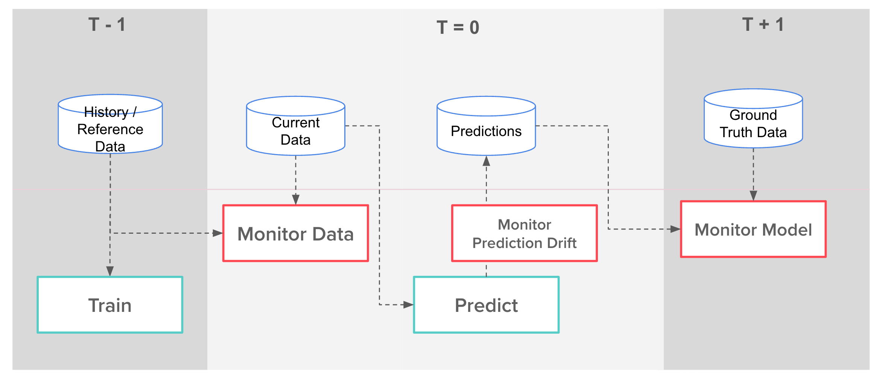
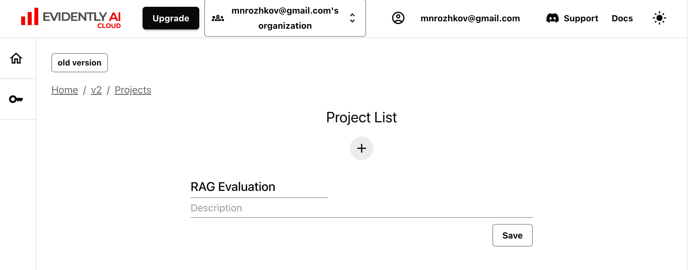
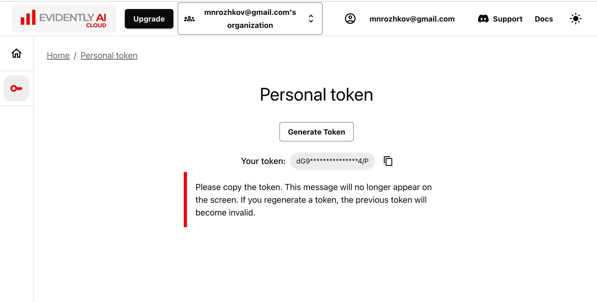

# 🚀 Tutorial: Monitoring for Modern AI and MLOps

## 👀 Description

🎓 **What is this?** Welcome to "Comprehensive ML Monitoring for Modern AI and MLOps." This tutorial is your guide to navigating the critical world of monitoring ML models and data. We'll explore key concepts and introduce popular open-source tools: **Evidently AI**, **MLflow**, and **Grafana**.

👩‍💻 **Who is this tutorial for?** If you're a Data Scientist, AI Developer, or ML Engineer aiming to build robust and reliable machine learning systems, this tutorial is for you. We'll cover foundational principles and practical applications.

🎯 **What will you learn in this tutorial?**

- The essential tasks and strategies for effective ML monitoring in an MLOps context, including different monitoring layers and paradigms.
- Setting up model performance and data quality monitoring with Evidently AI (using its modern API).
- Visualizing crucial monitoring metrics with Grafana dashboards.
- Integrating monitoring insights with MLOps tools like MLflow, including tracking model performance over time.

🔍 **How is it structured?** Through clear, step-by-step instructions with illustrative code examples (provided in accompanying notebooks) in Markdown format.

⏱️ **How much time will it take?** Approximately **45-60 minutes** to cover the concepts and tool introductions, with additional time if you run all code examples thoroughly.

---

## 📖 Table of Contents

<!-- - [🚀 Tutorial: Monitoring for Modern AI and MLOps](#-tutorial-monitoring-for-modern-ai-and-mlops) -->
- [👀 Description](#-description)
- [📖 Table of Contents](#-table-of-contents)
- [⚙️ 1 - Prerequisites & Installation](#️-1---prerequisites--installation)
- [🛠️ 2 - ML Monitoring: Core Tasks and Concepts in MLOps](#️-2---ml-monitoring-core-tasks-and-concepts-in-mlops)
  - [Essential Monitoring Layers in ML Systems (General)](#essential-monitoring-layers-in-ml-systems-general)
  - [Monitoring for Modern AI Applications (LLMs, Agents, RAGs)](#monitoring-for-modern-ai-applications-llms-agents-rags)
  - [Monitoring Paradigms: Batch vs. Online](#monitoring-paradigms-batch-vs-online)
  - [Popular Open-Source Tools for ML Monitoring](#popular-open-source-tools-for-ml-monitoring)
- [🏎️ 3 - Evidently AI for ML Models and Data Quality](#️-3---evidently-ai-for-ml-models-and-data-quality)
  - [Step 1: Prepare the data](#step-1-prepare-the-data)
  - [Step 2: Create a monitoring report](#step-2-create-a-monitoring-report)
  - [Step 3: Visualize or save the report](#step-3-visualize-or-save-the-report)
- [🧠 4 - Evidently AI for LLM-powered Systems and Agents](#-4---evidently-ai-for-llm-powered-systems-and-agents)
  - [Overview of Key Features](#overview-of-key-features)
  - [Use Cases and Applications](#use-cases-and-applications)
  - [Step 1: Create a free account at Evidently Cloud](#step-1-create-a-free-account-at-evidently-cloud)
  - [Step 2: Create a Project "RAG Evaluation"](#step-2-create-a-project-rag-evaluation)
  - [Step 3: Run the RAG Evaluation example](#step-3-run-the-rag-evaluation-example)
- [🤖 5 - Tracing and Evaluating AI Agents with MLflow](#-5---tracing-and-evaluating-ai-agents-with-mlflow)
  - [Step 1: Gaining Visibility with Autologging](#step-1-gaining-visibility-with-autologging)
  - [Step 2: Tracking Metrics and Artifacts](#step-2-tracking-metrics-and-artifacts)
  - [Step 3: Managing and Comparing Prompts with MLflow Prompt Registry](#step-3-managing-and-comparing-prompts-with-mlflow-prompt-registry)
  - [Conclusion](#conclusion)
- [📊 6 - Monitoring AI Systems with Grafana and PostgreSQL](#-6---monitoring-ai-systems-with-grafana-and-postgresql)
  - [Step 1: Launch Grafana and PostgreSQL](#step-1-launch-grafana-and-postgresql)
  - [Step 2: Calculate Monitoring Metrics (Using Evidently AI)](#step-2-calculate-monitoring-metrics-using-evidently-ai)
  - [Step 3: Prepare the PostgreSQL Monitoring Database](#step-3-prepare-the-postgresql-monitoring-database)
  - [Step 4: Log Model Quality Metrics to PostgreSQL](#step-4-log-model-quality-metrics-to-postgresql)
  - [Step 5: Explore the Pre-configured Grafana Dashboard](#step-5-explore-the-pre-configured-grafana-dashboard)
  - [Step 6: Customize Grafana Panels (Exercise)](#step-6-customize-grafana-panels-exercise)
- [🔗 7 - Additional Resources](#-7---additional-resources)
- [🎉 8 - Next Steps & Conclusion](#-8---next-steps--conclusion)

---

## ⚙️ 1 - Prerequisites & Installation

Before you start with ML monitoring, make sure your development environment is ready with Python, the necessary tools, and the project code.

**Prerequisites:**

- **Python 3.9+** installed.
- **uv** (a fast, modern Python package manager) installed.
  - If you don't have `uv`, install it with: `pip install uv` or `pipx install uv`. See the [official `uv` documentation](https://github.com/astral-sh/uv) for more options.
- **Git** installed (for cloning the project repository).
- **Docker** and **Docker Compose** installed (for running monitoring infrastructure).
- Basic understanding of Python, pandas, and machine learning concepts.
- Familiarity with the command line/terminal.

> 💡 **Project Structure:** This tutorial assumes a project structure with `data/`, `src/`, `notebooks/` directories at the project root.

**Setup Instructions:**

For detailed, step-by-step instructions on how to:

1. Clone the project repository,
2. Create a Python virtual environment using `uv`, and
3. Install all required dependencies,

please refer to the **[👩‍💻 Quick Start: Installation & Setup section in the project's README.md file](README.md#️-quick-start-installation--setup)**.

Once you have completed the setup steps in the `README.md`, your environment will be ready for the hands-on ML monitoring tutorial.

---

## 🛠️ 2 - ML Monitoring: Core Tasks and Concepts in MLOps

Effective ML monitoring is a cornerstone of robust MLOps practices, ensuring models perform reliably and deliver value over time. It's the continuous process of observing, tracking, and analyzing the performance, behavior, and data of ML systems in production.

### Essential Monitoring Layers in ML Systems (General)

Monitoring an ML system involves observing several interconnected layers, crucial for any type of ML model:

1. **🖥️ System Health & Performance:**
    - *Focus:* Backend infrastructure, API responsiveness.
    - *Metrics:* Prediction service latency, throughput, error rates, uptime, resource (CPU/memory/GPU) usage.
2. **💾 Data Integrity & Quality:**
    - *Focus:* Validity and statistical properties of input data for inference and retraining.
    - *Key Concerns:* **Data Drift** (changes in feature distributions), schema violations, missing values, outliers.
    - *MLOps Link:* Data issues often trigger alerts for data pipeline reviews or retraining. Feature Stores can help maintain consistency.
3. **🧠 ML Model Performance:**
    - *Focus:* The model's predictive power and behavior in production.
    - *Key Concerns:* **Prediction Drift** (changes in output distribution), **Concept Drift** (changes in feature-target relationships), degradation of accuracy metrics (e.g., F1, MAE), model staleness, fairness, and bias.
    - *MLOps Link:* Performance drops often initiate automated retraining workflows or investigation into data changes.
4. **📈 Business or Product KPIs:**
    - *Focus:* The model's impact on overarching business objectives.
    - *Metrics:* Click-through rates, conversion, revenue impact, user engagement, operational efficiency gains.
    - *MLOps Link:* Demonstrates the ROI of ML initiatives and guides strategic decisions.


>*Source: [Evidently AI Blog - ML Monitoring Metrics](https://www.evidentlyai.com/blog/ml-monitoring-metrics)*

These layers are not isolated. For example, a drop in a business KPI (Layer 4) might be traced back to model performance degradation (Layer 3), caused by data drift (Layer 2), due to an issue in a data ingestion service (Layer 1). This holistic view is central to **ML Observability**, providing deeper insights into *why* issues occur, not just *that* they occurred.

### Monitoring for Modern AI Applications (LLMs, Agents, RAGs)

While the layers above apply to all ML, "Modern AI" applications like Large Language Models (LLMs), Autonomous Agents, and Retrieval-Augmented Generation (RAG) systems introduce specific monitoring challenges and metrics due to their complexity, non-deterministic nature, and handling of unstructured data.

- **Data Integrity & Quality:** Beyond tabular feature drift, monitoring involves:
  - **Prompt/Query Characteristics:** Drift in prompt length, style, complexity, or topics.
  - **Bias Detection:** Identifying potential biases in input prompts or external data sources.
  - **Context Relevance (RAG):** Ensuring retrieved documents are relevant, fresh, and high-quality.
  - **Unstructured Data Issues:** Monitoring quality of text data, documents, or other unstructured inputs. This often involves analyzing text properties or embeddings.
- **AI Model Performance:** Traditional metrics are often insufficient. Key concerns and metrics include:
  - **Generation Quality:** Fluency, coherence, factual consistency (especially for RAG), toxicity, style drift.
  - **Hallucination Rate:** Tracking how often the model generates factually incorrect or nonsensical information.
  - **Task Success (Agents):** Measuring if the agent successfully completes multi-step instructions.
  - **Efficiency & Cost:** Monitoring token usage, API call volume, and computational costs.
  - **Bias in Outputs:** Detecting if generated text or agent actions exhibit unfair biases.
  - **Evaluation:** Often relies on subjective human evaluation, LLM-as-a-judge techniques, or specialized benchmarks. Quantitative metrics like Perplexity, BLEU, ROUGE, and specialized RAG metrics (Context Relevance, Groundedness, Answer Relevance) are also used.
- **ML Observability:** Gaining insight into the step-by-step execution of Agents or the retrieval and generation process in RAG is crucial for debugging and understanding behavior. Tracing the flow of data and control through complex pipelines is key.

### Monitoring Paradigms: Batch vs. Online

ML monitoring can be implemented using different paradigms depending on the application's needs and the availability of data/labels:

- **Batch Monitoring:** This is suitable for systems where predictions are generated in batches (e.g., daily reports, weekly recommendations) or when ground truth labels are available with a delay. Monitoring checks are run periodically on collected data chunks. This approach is versatile and often simpler to implement.
- **Online (Real-time) Monitoring:** This is necessary for low-latency, real-time prediction services (e.g., fraud detection, personalized recommendations). Metrics are computed continuously or near real-time from live request/response data streams. This requires more sophisticated infrastructure for data ingestion and processing.

Understanding the appropriate paradigm is crucial for designing the monitoring system.

### Popular Open-Source Tools for ML Monitoring

Monitoring in MLOps utilizes various open-source tools, each often specializing in different layers or aspects of the ML system. While many foundational tools apply broadly, some are gaining prominence for modern AI applications like LLMs, Agents, and RAGs.

Here's an overview of popular tools, including those covered in this tutorial:

| Tool                   | Primary Focus / Use Case                          | Relevance to Modern AI / LLMs & GenAI                                 | Covered Here? |
| :--------------------- | :------------------------------------------------ | :-------------------------------------------------------------------- | :------------ |
| **Evidently AI**       | Data & Model Drift, Performance Reports           | Text & Embedding Drift, LLM Evaluation Metrics (via custom). Visual reports. | **Yes**       |
| **Grafana**            | Time-Series Visualization & Dashboarding          | Visualize *any* ML metric over time (Drift, Performance, Cost, etc.)    | **Yes**       |
| **MLflow**             | ML Lifecycle (Tracking, Logging, Registry)        | Log monitoring results (reports, metrics), model artifacts. Historical view. | **Yes**       |
| **whylogs**            | Data Profiling & Statistical Monitoring           | Profile Text/Embeddings, generate statistical summaries, detect drift. | No            |
| **Phoenix (by Arize)** | LLM Application Observability & Evaluation        | RAG/Agent tracing, LLM generation evaluation (factuality, etc.). UI for analysis. | No            |
| **OpenTelemetry**      | Application Instrumentation & Tracing             | Instrumental for tracing multi-step Agent/RAG pipeline execution.   | No            |
| **Great Expectations** | Data Validation & Quality Assertions ("Expectations") | Input/Output Schema validation, basic text properties. Batch checks.    | No            |

---

## 🏎️ 3 - Evidently AI for ML Models and Data Quality

**Evidently AI** is a tool designed to calculate a wide array of metrics for evaluating your ML models and data quality. It presents these insights in interactive HTML reports or JSON snapshots, which are invaluable for debugging, validation, and crucial for ongoing monitoring. Evidently supports various data types, including tabular data, text, and embeddings.

 Evidently -> Report/Metrics">

ML monitoring within a ML model lifecycle (or ML pipeline) typically involves distinct stages:

- **T - 1 (Training):** The model is trained or updated using historical data (Reference Data). This process can occur daily, weekly, or on another defined schedule.
- **T = 0 (Prediction):** The trained model is used to make predictions on the most recent data (Current Data).
- **T + 1 (Monitoring):** After predictions are made (and sometimes when actual outcomes or Ground Truth Data become available), you monitor the model's performance and the data's characteristics on this new data, often by comparing it back to the Reference Data.



In the context of monitoring these ML pipelines, the key objectives include:

1. **Monitor Model Performance:** Evaluate how well the model is performing on new data over time. This involves checking stability and accuracy using appropriate metrics (if ground truth is available).
2. **Monitor Data Quality & Drift:** Track changes in the characteristics of the input data, such as shifts in feature distributions, missing values, or new categories. Data drift can silently degrade model performance.
3. **Monitor Prediction Drift:** Analyze changes in the distribution of the model's outputs or predictions over time. This can signal potential issues even before you have ground truth data to measure performance directly.

Evidently AI provides the tools and metrics necessary to perform these monitoring tasks effectively. Its core workflow involves comparing your "Current Data" (from the T=0 prediction step) and optionally "Ground Truth" (from T+1) against your "Reference Data" (from the T-1 training step).

### Step 1: Prepare the data

> 💡 **Open the example notebook:** `notebooks/1-evidently-getting-started.ipynb`

Let's begin with a practical example using Evidently AI to monitor a dataset.

In most cases, Evidently uses two datasets (`reference` and `current`) to calculate metrics and generate reports:

- The **`reference`** dataset is the benchmark or baseline data. This typically consists of data used for model training or a sample from historical *production* data.
- The **`current`** dataset is the recent or ongoing *production* data that you want to compare against the reference.


### Step 2: Create a monitoring report

The next step is to create a monitoring report. Evidently AI provides a wide range of [metrics and presets](https://docs.evidentlyai.com/metrics/all_presets) to evaluate the quality of your data and model.

```python
report = Report([
        DataSummaryPreset() #or try DataDriftPreset()
    ],
    include_tests="True"
)
my_eval = report.run(eval_data_1, eval_data_2)
```

### Step 3: Visualize or save the report

You can visualize the report in Evidently Cloud or inside the notebook.


You may export the report in HTML or JSON format.

```python
my_eval.save_html('report.html')
```

---

## 🧠 4 - Evidently AI for LLM-powered Systems and Agents

As LLMs power increasingly complex systems and **AI Agents** that perform multi-step tasks and use tools, ensuring their reliability and safety is crucial. Evidently AI provides a dedicated platform to comprehensively test these advanced LLM systems and agents, helping teams build robust and safe AI products.


### Overview of Key Features

Evidently AI covers the full testing lifecycle for LLM systems and agents with these core capabilities:

1. **Automated Evaluations (EVALS):**
    - Run structured tests using built-in and custom metrics (factuality, relevance, safety, **agent logic, tool use**).
    - Scale grading with LLM-as-a-judge.
    - Catch hallucinations, errors, and safety risks early.

2. **Synthetic Data Generation:**
    - Generate realistic test cases, including **complex multi-turn interactions for agents**.
    - Test edge cases and **adversarial attacks specific to agents** (e.g., prompt injection via tools).
    - Adapt tests as user behavior and risks evolve.

3. **Test Suite Management (TEST):**
    - Organize and version test suites for different models, prompts, and **agent workflows**.
    - Collaborate with experts on test case definition.
    - Catch regressions automatically in your pipeline.

4. **Comprehensive Reports:**
    - Get clear insights into where the system or **agent** fails.
    - Compare different versions side-by-side.
    - Drill into specific failures (**including agent step-by-step analysis**).
    - Prioritize fixes based on failure patterns.

5. **Continuous Monitoring:**
    - Track performance in production post-launch.
    - Validate new releases and updates with automated tests.
    - Identify emerging risks and **shifts in agent behavior** with live data.

### Use Cases and Applications

Evidently AI helps you focus testing on critical risks and workflows:

- **AI Agent Testing:** Directly test the reliability and effectiveness of **multi-step workflows, reasoning, and tool use** in agents.
- **Adversarial Testing:** Evaluate system and agent resilience against jailbreaks, PII leaks, and harmful content generation.
- **RAG Evaluation:** Test hallucination and retrieval failures, especially for RAG components used by agents.
- **ML System Monitoring:** Monitor traditional ML components interacting with or orchestrated by your agents.

Using Evidently AI provides the confidence, safety assurance, and debug insights needed for complex LLM-powered systems and AI Agents.

### Step 1: Create a free account at Evidently Cloud

For more details, see [Evidently Cloud Documentation](https://docs.evidentlyai.com/docs/setup/cloud)

### Step 2: Create a Project "RAG Evaluation"



To continue the example, you also need to get an Access Tokens. You can get them from the [Evidently Cloud Documentation](https://docs.evidentlyai.com/docs/setup/cloud).


### Step 3: Run the RAG Evaluation example

> 💡 **Open the example notebook:** `notebooks/2-evidenlty-rag-metrics.ipynb`

---

## 🤖 5 - Tracing and Evaluating AI Agents with MLflow

Developing AI Agents that perform multi-step tasks, utilize tools, and interact with external systems presents significant challenges. Unlike traditional software, their execution can feel like a "black box" – opaque, hard to debug, and difficult to compare across iterations. MLflow provides powerful capabilities to bring structure, observability, and rigorous evaluation to the agent development lifecycle.

> 💡 This section uses an example adapted from a [tutorial notebook demonstrating MLflow with CrewAI](https://github.com/mnrozhkov/nebius-ai-examples/blob/main/mlflow-examples/mlflow-agent-ai-research.ipynb).

The scenario involves a CrewAI system designed to research AI/ML tools. We'll see how MLflow tackles common agent development problems:

- **Black Box Execution:** Understanding the step-by-step process and reasoning.
- **Comparing Changes:** Reliably evaluating the impact of prompt or configuration tweaks.
- **Debugging Failures:** Pinpointing *why* an agent failed and what happened before the error.
- **Performance & Cost:** Tracking execution time, token usage, and associated costs.
- **Output Quality:** Systematically evaluating the quality of the agent's final output.

Let's explore how MLflow features address these issues, following the pattern of the example notebook.

### Step 1: Gaining Visibility with Autologging

Initially, running an agent often results in a flood of verbose console output that's hard to parse or save for later analysis. The first step to observability is capturing the execution trace.

MLflow's `mlflow.<framework>.autolog()` feature can automatically log key information from supported libraries like CrewAI.

```python
import mlflow

# Turn on auto tracing for CrewAI
mlflow.crewai.autolog()

# Set an experiment name for better organization
mlflow.set_experiment("Agent Research Pipeline")

# Instantiate and run your agent crew
# ai_dev_crew = AIOpsResearchCrew(...)
# result = ai_dev_crew.run()
```

By simply adding `mlflow.crewai.autolog()`, MLflow will automatically record information about the LLM calls made by the agents within the crew run. While basic, this starts the process of structured logging, capturing inputs and outputs of the underlying LLM interactions which are the core of agent decision-making.

### Step 2: Tracking Metrics and Artifacts

To go beyond simple tracing and enable quantitative comparison and debugging, you need to explicitly log key data points and outputs:

- **Parameters:** Log the configuration used for the run (e.g., the task description, the existing tech stack, LLM parameters).
- **Metrics:** Track quantitative measures like execution time, the number of tokens used (both prompt and completion), and estimated cost.
- **Artifacts:** Save the outputs of the agent's work, such as generated reports, analysis files (e.g., JSON outputs from intermediate tasks).

Modify your agent execution logic to wrap the run in an `mlflow.start_run()` block and use `mlflow.log_param()`, `mlflow.log_metrics()`, and `mlflow.log_artifact()`.

```python
# Example snippet from a modified Crew class's run method
import time
import json
import os

# ... inside a method, after crew setup ...

with mlflow.start_run(run_name=f"Tool_Research_{int(time.time())}") as mlflow_run:
    # Run the agent crew
    # result = self.crew.kickoff()

    # Log parameters (task, stack, etc.)
    mlflow.log_param("task", self.task)
    mlflow.log_param("ai_stack", self.ai_stack)
    # Add other relevant params like LLM model name, agent configurations...

    # Log metrics (token usage, time, cost)
    if hasattr(self.crew, 'usage_metrics'):
         mlflow.log_metrics(json.loads(self.crew.usage_metrics.json())) # Example from CrewAI

    # Log output files generated by the agent tasks
    artifact_files = [
        "output/tool_candidates.json",
        "output/tool_analysis.json",
        "output/tool_recommendation_report.md",
    ]
    for file_path in artifact_files:
        if os.path.exists(file_path):
            mlflow.log_artifact(file_path)

    # Optionally log a status tag for easy filtering
    mlflow.set_tag("status", "SUCCESS" if os.path.exists("output/tool_recommendation_report.md") else "FAILED")

# ... rest of the method ...
```

Viewing the run in the MLflow UI now provides a structured summary of the inputs, performance metrics, and generated outputs, making it much easier to see the result of each execution and compare runs.

### Step 3: Managing and Comparing Prompts with MLflow Prompt Registry

Prompts are critical "parameters" for LLMs and agents, yet managing their versions and tying them to specific runs is challenging. The MLflow Prompt Registry provides a centralized system for this.

```python
# Register a new prompt template
prompt_version = mlflow.register_prompt(
    name="create-report-prompt", # A name for your prompt
    template="Your prompt template here with {{placeholders}}",
    commit_message="Initial version of the report generation prompt",
    version_metadata={"purpose": "Generates final research report"}
)

# Update the prompt template (registers a new version)
improved_prompt_version = mlflow.register_prompt(
    name="create-report-prompt",
    template="An improved prompt template...",
    commit_message="Added instructions for Markdown formatting",
)

# Load a specific version (or the latest) of the prompt
loaded_prompt = mlflow.load_prompt("create-report-prompt") # Loads latest version by default
# or mlflow.load_prompt("create-report-prompt@latest")
# or mlflow.load_prompt("create-report-prompt/2") # Load version 2

# Use the loaded prompt template in your agent task definition
# tasks.create_report_task(..., description=loaded_prompt.format(task=self.task, ai_stack=self.ai_stack))
```

Using the Prompt Registry:
- Provides version control for prompts.
- Allows you to easily load specific prompt versions in your code.
- Crucially, MLflow automatically logs which version of a registered prompt was used in an MLflow run when you use `mlflow.load_prompt`. This creates a direct link between prompt versions and run results in the UI.

### Conclusion

Integrating MLflow into your AI Agent development process, as demonstrated by the CrewAI example, transforms it from a potentially chaotic "black box" into a structured engineering workflow. You gain:

- **Traceability:** Understand agent execution and LLM calls.
- **Reproducibility:** Capture configurations and prompt versions precisely.
- **Comparison:** Systematically evaluate the impact of changes on performance, cost, and quality.
- **Debugging:** Quickly diagnose failures using logged information and artifacts.
- **Evaluation:** Automate quality assessment using methods like LLM-as-a-judge.

By leveraging MLflow tracking, logging, evaluation, and prompt management features, you can iterate faster, debug more effectively, and build more reliable and performant AI agents.

---

## 📊 6 - Monitoring AI Systems with Grafana and PostgreSQL

> 💡 **Open the example notebook:** `notebooks/3-grafana-getting-started.ipynb`

Use Grafana to create dashboards for ML metrics stored in PostgreSQL. This allows visualizing trends in model performance and data drift over time.

### Step 1: Launch Grafana and PostgreSQL

(Docker Compose instructions and Grafana login remain the same)

```bash
docker compose up -d
```


### Step 2: Calculate Monitoring Metrics (Using Evidently AI)

(Reference to the notebook and the metric extraction function `get_model_monitoring_metrics_for_grafana` remains. This function would extract metrics from Evidently AI reports suitable for time-series storage.)

### Step 3: Prepare the PostgreSQL Monitoring Database

(Reference to the accompanying notebook (`4-monitor-model-with-grafana.ipynb`) which contains the SQLAlchemy definition for the `model_performance` table and likely calls a utility function (e.g., from `src/db_utils.py`) like `create_db()` to establish this table in your PostgreSQL database.)


### Step 4: Log Model Quality Metrics to PostgreSQL

(The conceptual loop logging metrics to PostgreSQL table `model_performance` remains. The actual code in the notebook would take the metrics extracted from Evidently AI (as in Section 4, Step 7) and insert them into the PostgreSQL database with a timestamp.)


> 💡 **Online Monitoring Context:** For real-time APIs, metrics would be computed from logged request/response data, often asynchronously, and fed into a similar time-series database for Grafana. [2, 33, 34]

### Step 5: Explore the Pre-configured Grafana Dashboard

(Instructions for editing panels, changing visualization to Gauge, modifying queries, and using suggestions remain the same conceptually; detailed steps are in the notebook.)


### Step 6: Customize Grafana Panels (Exercise)

(The exercise to add MAPE to the dashboard, by uncommenting code in the notebook and updating Grafana, remains).

> 🎨 **Dashboard as Code:** Grafana dashboards can be defined as JSON and provisioned automatically, aligning with MLOps "Infrastructure/Dashboard as Code" principles.

---

## 🔗 7 - Additional Resources

- [Evidently AI Official Documentation](https://docs.evidentlyai.com/)
- [🧠 LLM Evaluation Course](https://github.com/evidentlyai/community-examples/tree/main/learn)
  - Video lectures: https://youtube.com/playlist?list=PL9omX6impEuNTr0KGLChHwhvN-q3ZF12d&feature=shared
  - Code examples: <https://github.com/evidentlyai/community-examples/tree/main/learn>
- [Grafana Documentation](https://grafana.com/docs/grafana/latest/)
- [MLflow Documentation](https://mlflow.org/docs/latest/index.html)

---

## 🎉 8 - Next Steps & Conclusion

Congratulations on completing this tutorial on ML monitoring! You've explored key tools like Evidently AI, MLflow, and Grafana, vital for robust MLOps. You've learned about different monitoring layers, understood the difference between batch and online monitoring, and seen how to track tabular model performance over time.

**Where to go from here?**

ML monitoring is a dynamic and critical field in MLOps. Continuous learning and adapting these tools will be key to building trustworthy and reliable AI systems. Consider exploring:

- 🔄 **Online/Real-time Monitoring Implementation:** Investigate architectures and tools needed to implement online monitoring for low-latency inference services, contrasting it further with the batch examples covered here.
- 📈 **Monitoring Other Data Types:** Dive deeper into monitoring methodologies and metrics for non-tabular data, such as text, images, and embeddings, including tools like Evidently AI's specific metrics for these data types.
- 💰 **Cost Monitoring:** Integrate monitoring of computational resources (CPU, GPU, memory) and cloud service costs associated with your ML inference and monitoring infrastructure.
- 🔗 **Data Pipeline Monitoring:** Expand your focus upstream to monitor the health, performance, and data quality of the ETL/ELT pipelines that prepare data for your ML models. Great Expectations is a part of this, but consider pipeline orchestration tool monitoring too.
- 🔬 **ML Observability Platforms:** Investigate dedicated commercial or advanced open-source platforms (like Arize, Fiddler, WhyLabs, Aporia, Evidently Cloud) that offer integrated ML observability capabilities, often including real-time monitoring, sophisticated alerting, and debugging tools.
- ☁️ **Cloud-Native Monitoring:** Explore the monitoring services offered by major cloud providers (AWS SageMaker Model Monitor, GCP Vertex AI Model Monitoring, Azure ML Model Monitoring) if you are working within a specific cloud ecosystem.
- ⚙️ **Automate with Orchestrators:** Integrate monitoring jobs (like running Evidently reports or GX checkpoints) into MLOps pipelines using orchestrators like Airflow, Kubeflow, or Prefect.
- 🔔 **Advanced Alerting:** Set up sophisticated alerts in Grafana or via custom scripts triggered by monitoring results, routing notifications to the appropriate teams.

Armed with the knowledge from this tutorial and a path forward for deeper exploration, you are well-equipped to build and maintain robust and reliable AI systems in a modern MLOps environment.

[⬆️ Back to Table of Contents](#-table-of-contents)
