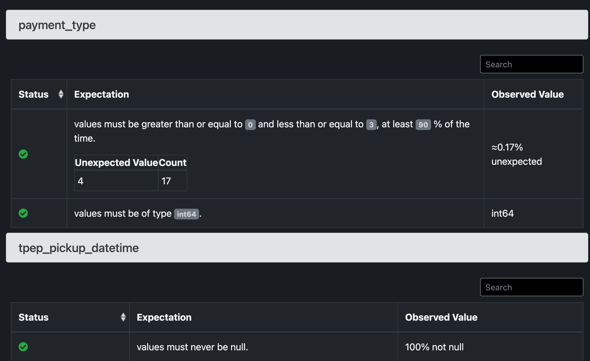

# Тьюториал: Основы ML мониторинга для Data Science

## 👀 Overview

🎓 **Что это такое?** Представляем вашему вниманию тьюториал "Основы ML мониторинга для Data Science". Это ваш путеводитель в мире мониторинга ML моделей и данных. Мы не просто покажем вам, как это делается, но и расскажем о популярных инструментах в этой области, таких как Evidently и Great Expectations.

👩🏻‍💻 **Для кого этот тьюториал?** Если вы Data Scientist или начинающий ML инженер, этот курс идеально подойдет для вас. Мы начнем с основ и постепенно перейдем к более продвинутым темам.

**🎯 Что вас ждет в этом тьюториале?**

- Знакомство с задачами и инструментами ML мониторинга.
- Настройка мониторинга моделей и данных с помощью Evidently.
- Изучение мониторинга данных с Great Expectations.

🔍 **Как это устроено?** Вам не придется долго искать нужную информацию. Тьюториал содержит исчерпывающие примеры кода и пошаговые инструкции в формате Markdown.

⏱️ **Сколько времени потребуется?** Вам понадобится всего 40 минут, чтобы погрузиться в мир ML мониторинга и выйти оттуда уже готовым к применению новых знаний.


## 📖 Содержание
- [Тьюториал: Основы ML мониторинга для Data Science](#тьюториал-основы-ml-мониторинга-для-data-science)
  - [👀 Overview](#overview)
  - [📖 Содержание](#-содержание)
  - [👩‍💻 1 - Установка](#1-установка)
  - [🛠️ 2 - Задачи и инструменты ML мониторинга для Data Science](#️-2-задачи-и-инструменты-ml-мониторинга-для-data-science)
    - [Задачи мониторинга в ML](#задачи-мониторинга-в-ml)
    - [Инструменты для ML мониторинга](#инструменты-для-ml-мониторинга)
  - [🏎️ 3 - Evidently для метрик качества моделей и данных](#️-3-evidently-для-метрик-качества-моделей-и-данных)
    - [Шаг 1 - Импорт Evidently](#шаг-1-импорт-evidently)
    - [Шаг 2 - Подготовка данных](#шаг-2-подготовка-данных)
    - [Шаг 3 - Построение Data Drift отчетов](#шаг-3-построение-data-drift-отчетов)
    - [Шаг 4 - Кастомизация и сохранение отчетов](#шаг-4-кастомизация-и-сохранение-отчетов)
  - [🤝 4 - Мониторинг моделей и данных с Evidently и MLflow](#-4-мониторинг-моделей-и-данных-с-evidently-и-mlflow)
    - [Шаг 1 - Загрузка данных](#шаг-1-загрузка-данных)
    - [Шаг 2 - Определение структуры колонок](#шаг-2-определение-структуры-колонок)
    - [Шаг 3 - Обучение модели](#шаг-3-обучение-модели)
    - [Шаг 4 - Построение отчета о валидации модели](#шаг-4-построение-отчета-о-валидации-модели)
  - [🎱 5 - Мониторинг данных с Great Expectations](#-5-мониторинг-данных-с-great-expectations)
    - [Шаг 1 - Импорт необходимых библиотек](#шаг-1-импорт-необходимых-библиотек)
    - [Шаг 2 - Загрузка и подготовка данных](#шаг-2-загрузка-и-подготовка-данных)
    - [Шаг 3 - Обзор набора данных](#шаг-3-обзор-набора-данных)
    - [Шаг 4 - Создание ожиданий](#шаг-4-создание-ожиданий)
    - [Шаг 5 - Сохраните набор ожиданий ( `suite` )](#шаг-5-сохраните-набор-ожиданий-suite-)
    - [Шаг 6 - Валидация новых данных с Great Expectations](#шаг-6-валидация-новых-данных-с-great-expectations)
  - [🔗 Дополнительные ресурсы](#-дополнительные-ресурсы)

## 👩‍💻 1 - Установка

Этот раздел руководства поможет вам настроить среду для работы с тьюториалом по ML мониторингу.

**1. Сделайте форк / клонируйте этот репозиторий**

Клонируйте репозиторий с примером кода. Этот репозиторий предоставляет необходимые файлы и скрипты для тьюториала.

```bash
git clone https://gitlab.com/risomaschool/tutorials-raif/monitoring-1-get-started.git
cd monitoring-1-get-started
```

**2. Создайте виртуальное окружение** 

Для этого примера требуется Python версии 3.9 или выше. Создайте и активируйте виртуальное окружение:

```bash
python3 -m venv .venv
echo "export PYTHONPATH=$PWD" >> .venv/bin/activate
source .venv/bin/activate
pip install --upgrade pip setuptools wheel
pip install -r requirements-dev.txt
```

**3. Загрузите данные** 

Вам потребуется два датасета. 

1. Загрузите [набор данных по аренде велосипедов](https://archive.ics.uci.edu/ml/datasets/bike+sharing+dataset) в директорию `data/`.

```bash
python src/load_data.py
```

2. Загрузите [набор данных по поездкам на такси в Нью-Йорке в январе 2019 года](https://www1.nyc.gov/site/tlc/about/tlc-trip-record-data.page) в директорию `data/`.

```bash
wget https://d37ci6vzurychx.cloudfront.net/trip-data/yellow_tripdata_2019-01.parquet -O data/yellow_tripdata_2019-01.parquet
```

**4. Запустите MLflow UI**

To start the MLflow UI, run:

```bash
mlflow ui
```

And then navigate to [http://localhost:5000](http://localhost:5000) in your browser

**5. Запустите Jupyter Lab or Jupyter Notebook**

```bash
jupyter lab
```

## 🛠️ 2 - Задачи и инструменты ML мониторинга для Data Science

### Задачи мониторинга в ML

Что вы имеете ввиду, когда говорите "мониторинг в машиином обучении"? Точность модели? Качество данных? Или доля клиентов, которые которые выбирают рекомендованный товар/услугу? Скорее всего - комбиницию нескольких метрик!

Давайте попробуем структурировать компоненты мониторинга системы ML:

1. **Состояние (здоровье) системы:** На базовом уровне находится мониторинг бэкенда ПО, который включает в себя проверку успешности выполнения задач прогнозирования и производительности сервиса.
2. **Данные:** Следующий уровень фокусируется на качестве и целостности данных. Важно отслеживать, подходят ли данные для создания прогнозов и обучения модели.
3. **ML Модель:**  На этом уровне происходит мониторинг самой модели ML. Оценивается точность прогнозов, соответствие модели задачам и ее "честность".
4. **Бизнес или продуктовые KPI:** На вершине пирамиды находятся ключевые показатели эффективности, связанные с бизнес-целями и влиянием модели на продукт.

{width=800}
*Источник: [https://www.evidentlyai.com/blog/ml-monitoring-metrics](https://www.evidentlyai.com/blog/ml-monitoring-metrics)*

Все компоненты мониторинга взаимосвязаны. Например, если вы обнаружите, что точность модели ухудшается, вы можете проверить, не изменились ли данные, или не изменилась ли бизнес-логика.

С другой стороны, можно говорить о мониторинге, в контексте ML пайплайна, например, для задач батч-скоринга (batch scoring). Этот процесс включает в себя несколько ключевых этапов:

- **T - 1 (Тренировка)**: На этом этапе модель обучается на исторических данных (History / Reference Data). Это может быть ежедневный процесс, который обновляет модель каждый день, или более редкий процесс, который обновляет модель раз в неделю или месяц.
- **T = 0 (Прогнозирование)**: На этом этапе модель используется для прогнозирования на текущих данных (Current Data).
- **T + 1 (Мониторинг)**: После прогнозирования следует этап мониторинга. Здесь данные о реальных результатах (Ground Truth Data) сравниваются с прогнозами модели для оценки качества и точности модели.

{width=800}

В контексте мониторинга ML пайплайнов ключевые задачи включают в себя:

1. **Мониторинг модели (Monitor Model)**: Оценка производительности модели на новых данных, анализ ее стабильности и точности со временем.
2. **Мониторинг данных (Monitor Data)**: Отслеживание изменений в характеристиках входных данных (таких как распределение или возникновение новых паттернов), которые могут повлиять на работу модели.
3. **Мониторинг смещения прогнозов (Monitor Prediction Drift)**: Анализ изменений в прогнозированиях модели со временем, выявление смещения и ухудшения качества прогнозов.

### Инструменты для ML мониторинга

{width=800}

В данном тьюториале рассмотрим два популярных инструмента для мониторинг моделей и данных:

- **Evidently**: Позволяет анализировать качество модели и данных, обнаруживать смещения в прогнозах и многое другое.
- **Great Expectations**: Помогает валидировать качество данных, обеспечивая их соответствие определенным критериям.


## 🏎️ 3 - Evidently для метрик качества моделей и данных 

> 💡 Откройтие пример в  `notebooks/1-getting-started-tutorial.ipynb`

Идея Evidently очень проста: представить API для расчета рассчитывает множество метрик для данных и моделей, и организовать их в удобные отчеты. Отчеты являются наиболее эффективным способом визуального анализа и отладки ваших моделей и данных. Вы можете сохранять отчеты в форматах HTML или JSON (snapshots).
Это позволяет использовать Evidently для множества сценариев валидации и мониторинга в приложениях машинного обучения [для online инференса](https://evidentlyai.com/blog/fastapi-tutorial) и [batch скоринга](https://www.evidentlyai.com/blog/batch-ml-monitoring-architecture):

- анализ и отладка ML моделей и данных,
- генерация динамических отчетов мониторинга через [Панель мониторинга Evidently](https://docs.evidentlyai.com/user-guide/monitoring/monitoring_overview).
- интеграция результатов мониторинга с другими системами для хранения (например, в PostgreSQL) и или визуализации (например, в Grafana).

{width=800}

### Шаг 1 - Импорт Evidently

Для начала, импортируйте Evidently, а также pandas, numpy и пример датасета `california_housing`. 

```python
import pandas as pd
import numpy as np

from sklearn.datasets import fetch_california_housing

from evidently import ColumnMapping

from evidently.report import Report
from evidently.metrics.base_metric import generate_column_metrics
from evidently.metric_preset import DataDriftPreset, TargetDriftPreset
from evidently.metrics import *

from evidently.test_suite import TestSuite
from evidently.tests.base_test import generate_column_tests
from evidently.test_preset import DataStabilityTestPreset, NoTargetPerformanceTestPreset
from evidently.tests import *

```

### Шаг 2 - Подготовка данных

В примерах тьюториала вы работаете с готовым набором данных. На практике вы должны использовать логи прогнозов модели. Они могут включать входные данные, прогнозирования модели и истинные метки или фактические данные, если они доступны.

Для подготовки данных к анализу создайте pandas.DataFrame:

```python
data = fetch_california_housing(as_frame=True)
housing_data = data.frame
```

Переименуйте одну из колонок в "target" и создайте колонку "prediction". Таким образом, набор данных будет похож на логи применения модели с известными метками.

```python
housing_data.rename(columns={'MedHouseVal': 'target'}, inplace=True)
housing_data['prediction'] = housing_data['target'].values + np.random.normal(0, 5, housing_data.shape[0])

```
{width=800}

В большинстве случает Evidently использует два датасета ( `reference` и `current` ) для расчета метрик и генерации отчетов.
- Первый **reference** датасет - это эталонный набор данных. В качестве `reference`   обычно используют данные для обучения модели или выборку из истории *production* данных. 

- Второй **current** набор данных - это текущие *production* данные, которые вы хотите  сравнить с эталоном.

 ](docs/images/Untitled%205.png)

> ℹ️ Источник: [https://docs.evidentlyai.com/user-guide/input-data/data-requirements](https://docs.evidentlyai.com/user-guide/input-data/data-requirements) 

Разделите набор данных, взяв 5000 объектов для эталонных и текущих наборов данных.

```python
reference = housing_data.sample(n=5000, replace=False)
current = housing_data.sample(n=5000, replace=False)
```

> **🔌 Практические рекомендации:**
>
> 1. Для своего проекта вы можете подготовить два набора данных с одинаковой схемой. 
> 2. Вы также можете взять один набор данных и явно указать строки для эталонных и текущих данных.
> 3. Вы можете иметь несколько `reference` датасетов

### Шаг 3 - Построение Data Drift отчетов

Отчеты **Evidently** помогают исследовать и устранять проблемы качества данных и моделей. Они рассчитывают различные метрики и генерируют панель управления с богатыми визуализациями. Для начала вы можете использовать **Metric Presets** - шаблонные наборы метрик и отчеты для определенных задач. 

Давайте начнем с **Data Drift.** Этот пресет сравнивает распределения признаков модели и показывает, какие из них изменились. 

Чтобы получить отчет, создайте соответствующий объект `Report`, перечислите включаемый пресет и укажите на созданные ранее эталонные и текущие наборы данных:

```python
# Созадим отчет с нужным набором метрик или пресетом
report = Report(metrics=[
    DataDriftPreset(),
])

# Запустим генерацию отчета
report.run(reference_data=reference, current_data=current)

# Для визуализации отчета в Jupyter Notebook
report.show(mode='inline')
```

{width=800}

Если вы кликнете на отдельные признаки в отчете, вы увидите дополнительные графики для анализа. Например, распределение таргет переменной.

{width=800}

### Шаг 4 - Кастомизация и сохранение отчетов

В можете кастомизировать отчеты Evidently и явно указатть, какие метрики включить и как их рассчитывать.

Например, вот так можно перечислить несколько метрик, расчитывающие статистики для определенного столбца:

```python
report = Report(metrics=[
    ColumnSummaryMetric(column_name='AveRooms'),
    ColumnQuantileMetric(column_name='AveRooms', quantile=0.25),
    ColumnDriftMetric(column_name='AveRooms')
])

report.run(reference_data=reference, current_data=current)
```

Вы получите примерно такой отчет:

{width=800}

> 💡 Больше примеров метрик и отчетов можно найти в официальной документации: [Quickstart for Reports and Tests](https://docs.evidentlyai.com/get-started/tutorial#4.-get-the-data-drift-report)

Вы можете конвертировать сгенерированные отчеты с объект Python или JSON или сохранить HTML файл.

```python
report.as_dict()              # Удобно для парcинга отчета и получения отдельных метрик
report.save_html("file.html") # Удобно открыть и посмотреть в браузере 
```

Вы также можете сохранить вывод в виде Snapshot JSON. Это позволит вам визуализировать качество модели или данных в днимаке с помощью [ML Evidently Dashboards](https://docs.evidentlyai.com/get-started/tutorial-monitoring)

```python
report.save("snapshot.json")
```

## 🤝 4 - Мониторинг моделей и данных с Evidently и MLflow

> 💡 Пример в Jupyter Notebook `notebooks/2-monitor-model.ipynb`

### Шаг 1 - Загрузка данных

Загрузите данные из [репозитория UCI](https://archive.ics.uci.edu/ml/datasets/bike+sharing+dataset) и сохраните их локально. Эти данные будем использовать как входные для модели в реальном времени. 

```bash
# Download original dataset with: python src/pipelines/load_data.py 
raw_data = pd.read_csv(f"../{DATA_DIR}/{FILENAME}")

# Set datetime index 
raw_data = raw_data.set_index('dteday')

raw_data.head()
```

{width=800}

### Шаг 2 - Определение структуры данных

Укажите категориальные и числовые признаки, чтобы Evidently корректно проводил статистический анализ для каждого из них. Хотя Evidently может автоматически анализировать структуру данных, явное указание типа колонок - хорошая практика.

```python
# Определение признаков
target = 'cnt'
prediction = 'prediction'
numerical_features = ['temp', 'atemp', 'hum', 'windspeed', 'mnth', 'hr', 'weekday']
categorical_features = ['season', 'holiday', 'workingday']

# Создание объекта column_mapping
column_mapping = ColumnMapping()
column_mapping.target = target
column_mapping.prediction = prediction
column_mapping.numerical_features = numerical_features
column_mapping.categorical_features = categorical_features
```

### Шаг 3 - Обучение модели

Подготовьте train и test датасеты, и обучите модель с помощью алгоритма `RandomForestRegressor`.

```python
# Разделение данных
sample_data = raw_data.set_index('dteday').loc['2011-01-01 00:00:00':'2011-01-28 23:00:00']

X_train, X_test, y_train, y_test = model_selection.train_test_split(
    sample_data[numerical_features + categorical_features],
    sample_data[target],
    test_size=0.3
)
regressor = ensemble.RandomForestRegressor(random_state = 0, n_estimators = 50)
regressor.fit(X_train, y_train)
```

### Шаг 4 - Подготовка  *reference* датасета

Для создания отчета о валидации модели сначала подготовьте *reference* датасет. В этом примере мы возьмем данные за 2011 год и сделаем прогнозы для каждого часа.

```python
reference_data = raw_data.loc[train_dates[0]:train_dates[1]]
reference_data['prediction'] = regressor.predict(reference_data[FEATURE_COLUMNS])
reference_data = reference_data.reset_index(drop=True)
```

### Шаг 5 - Подготовка  *current* датасета

Для создания отчета о качестве модели за одну неделю (week 1) подговьте *current* датасет. В этом примере мы возьмем данные с `2011-03-07 00:00:00` по `2011-03-13 23:00:00`.

```python
# Выборка данных для week 1
current_dates = prediction_batches[0]
current_data = raw_data.loc[current_dates[0]:current_dates[1]]  

# Рассчет прогнозов для `current` датасета
current_prediction = regressor.predict(current_data[numerical_features + categorical_features])
current_data['prediction'] = current_prediction
current_data = current_data.reset_index(drop=True)
```

### Шаг 6 - Построение отчета о качестве модели

Теперь, можно сгенерировать отчет о качестве модели. Включим отчет только несколко метрик.

```python
model_report = Report(metrics=[
    RegressionQualityMetric(),
    RegressionErrorPlot(),
    RegressionErrorDistribution()
])
model_report.run(...)
```

Можно визуализировать отчет прямо в Jupyter Notebook используя команду 

```bash
regression_performance_report.show(mode='inline')
```

{width=800}

### Шаг 7 - Извлеките метрки качестве модели и отчета Evidently

Для получения метрик, таких как средняя ошибка (ME) и средняя абсолютная ошибка (MAE), из отчета, приходится немного "покапаться" в отчете.

> ℹ️ В момент написания тьюториала нет удобного API для ивлечения метрик из отчета. В будущем, возможно, это изменится.

Для тьюториала мы создали функцию `get_metrics_from_report`, которая извлекает метрики из отчета и возвращает словарь с результатами.

```python

def get_model_monitoring_metrics(
    regression_quality_report: Report
) -> Dict:

    metrics = {} 
    report_dict = regression_quality_report.as_dict()
    
    metrics['me'] = report_dict['metrics'][0]['result']['current']['mean_error']
    metrics['mae'] = report_dict['metrics'][0]['result']['current']["mean_abs_error"]
    metrics['rmse'] = report_dict['metrics'][0]['result']['current']["rmse"]
    metrics['mape'] = report_dict['metrics'][0]['result']['current']["mean_abs_perc_error"]
    
    return metrics
```

### Шаг 8 - Логирование и визулизация отчета о модели в MLflow 

Теперь, когда у вас есть отчет о качестве модели, вы можете сохранить его в MLflow. Это позволит вам визуализировать отчет в MLflow UI и сравнивать качество моделей в MLflow Experiments.

Покажем, как описанные выше шаги мониторинга можно применить для каждого периода.  Для этого мы разобьем данные на батчи по неделям и будем запускать мониторинг для каждого батча.

```python

# Запуск мониторинга для каждого батча
for current_dates in prediction_batches:

    # Создание нового MLflow Run для каждого батча
    # Датe окончания батча можно использовать как название Run
    with mlflow.start_run(run_name=current_dates[1]) as run: 
        
        # Даты начала и окончания батча можно сохранить как параметры
        mlflow.log_param("begin", current_dates[0])
        mlflow.log_param("end", current_dates[1])
        
        # Подготовка `current` датасета и отчета для батча 
        # Предполагаем, что `reference` датасет уже подготовлен
        current_data = ...  # см. Шаг 5 - Подготовка  *current* датасета
        model_report = ...  # см. Шаг 6 - Построение отчета о качестве модели
        
        # Подготовка метрик для MLflow 
        # см. Шаг 7 - Извлеките метрки качестве модели и отчета Evidently
        model_metrics = get_model_monitoring_metrics(model_report)

        # Логирование отчета в MLflow
        mlflow.log_metrics(model_metrics)
        
        # Логирование HTML отчета в MLflow
        monitoring_report_path = f"../{REPORTS_DIR}/model_monitoring_report.html"
        model_report.save_html(monitoring_report_path)
        mlflow.log_artifact(monitoring_report_path)
```

В результате, в MLflow UI ([http://127.0.0.1:5000/](http://127.0.0.1:5000/)) вы увидите результаты запуска мониоторинг и отчеты внутри.

{width=800}

> ⚠️ В предыдщих версиях MLflow отчеты открывались полностью. В последних версиях область прокрутки отчетов очень узкая. Надеемся это скоро починят.

## 🎱 5 - Мониторинг данных с Great Expectations (GX)

Great Expectations - это инструмент для управления качеством данных, который позволяет устанавливать и проверять "ожидания" относительно ваших данных.

{width=800}
> ℹ️ Источник: [About Great Expectations OSS](https://docs.greatexpectations.io/docs/oss/about/)

**Зачем использовать Great Expectations?**

> 💡 Expectation это, по сути, модульные тесты для ваших данных

- Тестиорвание и валидация данных
- Проверка корректности транфсормаций данных
- Мониторинг качества данных
- Проверка соответствия данных бизнес-правилам
- Документация данных

### Шаг 1 - Загрузите данные

> 💡 Откройте пример в `notebooks/3-great-expectations.ipynb`

Для начала работы необходимо импортировать Great Expectations и загрузить данные.

```python
import great_expectations as gx
```

В качестве данных для примера используется набор данных по поездкам на такси в Нью-Йорке. Данные можно скачать с [Amazon S3](https://d37ci6vzurychx.cloudfront.net/trip-data/yellow_tripdata_2019-01.parquet).

> ℹ️ Инструкция как скачать датасет в разделе [👩‍💻 1 - Установка](#1-установка)

Можно заглянуть внутрь файла и посмотреть на данные:

```python
df = pd.read_parquet('../data/yellow_tripdata_2019-01.parquet').sample(10000)
df.info()
```

Датасет содержит 19 столбцов четырех типов данных `datetime64[ns]`, `float64`, `int64`, `object`.

{width=800}

### Шаг 2 - Создайте Data Context

Data Context - это основной интерфейс для работы с Great Expectations. Он позволяет создавать и управлять наборами ожиданий (suites), источниками данных (datasources), а также проверять качество данных.

{width=800}

Создайте Data Context

```python
context = gx.get_context(project_root_dir="..")
```

При указании `project_root_dir` аргумента:

- В корне репозитория создается директория `gx` (Great Expectatoins использует эту директорию для хранения конфигураций)
- Конфигурация Data Context сохраняется в файл `gx/great_expectations.yml`

> ℹ️ Подробнее о Data Context: [Instantiate a Data Context](https://docs.greatexpectations.io/docs/oss/guides/setup/configuring_data_contexts/instantiating_data_contexts/instantiate_data_context)

### Шаг 3 - Подлключите данные и создайте Validator

Валидатор (`Validator`) - это объект, ответственный за выполнение набора валидации (`Expectation Suite`) на наборе данных из датасета (`Batch Request`). 

Рассмотрим два способа создания `Validator`.

**Способ 1 - Для этого тьюториала и простых кейсов**

Запустите следующую команду, чтобы подключиться к загруженным данным в `.parquet`, и создать объект `Validator`:

```python
validator = context.sources.pandas_default.read_parquet(
    '../data/yellow_tripdata_2019-01.parquet', 
)
```

В этом примере кода используется стандартный `Data Source` внутри уже созданного `Data Context` для Pandas, чтобы получить доступ к данным из файла.

**Способ 2 - Для практического применения**
Другой способ - это создание использовать метод `get_validator` объекта `Data Context`. Он предполагает следующий алгоритм: 

1. Создание `Data Source` для доступа к данным
2. Создание `Asset` для доступа к конкретному файлу или таблице
3. Создание `Batch Request` для запроса данных
4. Создание `Validator` для валидации данных

Разберем этот пример, используя код ниже. 

1. **Определение источника данных**:
   Источник данных (Data Source) обеспечивает стандартный API для доступа и взаимодействия с данными из разнообразных источников.

   ```python
   datasource = context.sources.add_pandas_filesystem(
       name='local_dir',               # Имя источника данных (произвольное)
       base_directory="../data"        # Путь к директории с данными
   )
   ```

   Здесь создается новый источник данных, работающий с файлами, находящимися в локальной директории `../data`.

2. **Добавление актива (Asset) к источнику данных**:
   `Asset`` представляет собой специфичную для источника данных сущность, например, таблицу в базе данных или файл в файловой системе.

   ```python
   # Регулярное выражение должно соответствовать именам файлов в директории данных
   asset = datasource.add_parquet_asset(
       name="parquet_asset",
       batching_regex=r"yellow_tripdata_(?P<year>\d{4})-(?P<month>\d{2}).parquet",
       order_by=["year", "month"],
   )
   ```

   Здесь создается актив для работы с файлами `.parquet`. Используется регулярное выражение для идентификации файлов по шаблону имени и группировки их по году и месяцу.

3. **Создание запроса на пакет данных (Batch Request)**:
   `Batch Request` используется для запроса пакета данных для валидации.

   ```python
   batch_request = asset.build_batch_request(options={"year": "2019", "month": "01"})
   ```

   В этом примере создается запрос на пакет данных, соответствующий файлу за январь 2019 года. Это делается путем указания опций, соответствующих году и месяцу в названии файла.

4. **Создание Validator**:
    Создайте объекст `Validator` с помощью метода `get_validator(...)` у объекта Data Context. 

   ```python
   validator = context.get_validator(
        datasource_name="local_dir",
        data_asset_name="yellow_tripdata_2019-01.parquet",
        batch_request=batch_request
    )
   ```

    Параметры метода get_validator:

    - `datasource_name="local_dir"`: указывает на имя источника данных (Datasource), который используется для доступа к данным.
    - `data_asset_name="yellow_tripdata_2019-01.parquet"`: имя конкретного актива данных (Data Asset), к которому применяется валидация.
    - `batch_request=batch_request`: объект Batch Request, который определяет, какие именно данные должны быть загружены для валидации. 

    Этот код полезен для создания настраиваемых конвейеров обработки и валидации данных в Great Expectations, особенно когда работа идет с большим количеством файлов, имеющих структурированные названия.

Созданный любым способом Validator является центральным компонентом в процессе валидации данных с использованием Great Expectations. Он позволяет не только проверять данные на соответствие заранее заданным критериям, но и документировать результаты этих проверок.

### Шаг 4 - Создание ожиданий (Expectations)

Great Expectations позволяет создавать Expectations и организовывать их в Expectations Suites, которые содержат правила или условия, применяемые к вашим данным.

```bash
validator.expect_column_values_to_be_between(column='payment_type', min_value=0, max_value=3, mostly=0.9)
validator.expect_column_values_to_be_of_type(column='payment_type', type_='int64')
```

В данном примере мы устанавливаем ожидание, что значения столбца `payment_type` будут находиться в определенном диапазоне и иметь определенный тип данных. Эти ожидания помогут нам убедиться, что данные соответствуют определенным критериям качества.

### Шаг 5 - Сохраните набор ожиданий (Expectation Suite)

Expectation Suite можно сохранять и использовать для проверки качества данных в будущем.

Создайте набор ожиданий и добавьте к нему правила:

```python
validator.save_expectation_suite('../gx/expectations/first_expectation_suite.json')
```

В результате создается файл `first_expectation_suite.json` в директории `gx/expectations`. Этот файл содержит набор ожиданий, который можно использовать для проверки качества данных в будущем.

### Шаг 6 - Валидация новых данных с Great Expectations

В этом шаге мы рассмотрим, как использовать Great Expectations для валидации новых данных. Мы будем использовать ранее сохранённый набор ожиданий (expectation suite) и применим его к новому набору данных.

1. **Получение Data Context**:
   Инициализируем контекст валидации, указав корневой каталог, где хранятся настройки Great Expectations. Назовем его `validation_context`, чтобы отличать от `context`, который мы использовали ранее.

   ```python
   validation_context = gx.get_context(context_root_dir="../gx")
   ```

2. **Список cохранённых Expectation Suites**:
   Получаем список всех сохранённых наборов ожиданий.

   ```python
   validation_context.list_expectation_suite_names()
   ```

   Эта команда выведет только сохраненный ранее набор ожиданий:

   ```bash
   ['first_expectation_suite']
   ```

3. **Загрузка Expectation Suite**:
   Загружаем определённый набор ожиданий, который будет использоваться для валидации.

   ```python
   validation_suite = validation_context.get_expectation_suite("first_expectation_suite")
   ```

4. **Загрузка данных для валидации**:
   Загружаем тестовые данные из CSV-файла.

   ```python
   test = pd.read_csv("../data/test.csv")
   ```

5. **Создание валидатора для тестовых данных**:
   Создаём валидатор для тестовых данных, используя ранее определённый набор ожиданий.

   ```python
   test_data_validator = (
        validation_context.sources.add_pandas("taxi_test_datasource")
        .read_dataframe(
            test, 
            asset_name="taxi_test", 
            batch_metadata={"type": "test"})
        )
   test_data_validator.expectation_suite_name = "first_expectation_suite"
   ```

6. **Запуск валидации**:
   Добавляем или обновляем чекпоинт, который связывает валидатор и набор ожиданий.

   ```python
   checkpoint = validation_context.add_or_update_checkpoint(
       name="my_taxi_validator_checkpoint", 
       validator=test_data_validator,
       expectation_suite_name="first_expectation_suite"
   )
   ```

   Запускаем чекпоинт для выполнения валидации.

   ```python
   checkpoint_result = checkpoint.run()
   ```

7. **Просмотр результатов валидации**:
   Открываем Data Docs для просмотра результатов валидации.

   ```python
   validation_context.open_data_docs()
   ```

   {width=800}

Этот процесс позволяет систематически проверять новые данные на соответствие установленным ожиданиям, обеспечивая тем самым их качество и надёжность.


## 🔗 Дополнительные ресурсы

- [Monitoring ML systems in production. Which metrics should you track?](https://www.evidentlyai.com/blog/ml-monitoring-metrics)
- [ML serving and monitoring with FastAPI and Evidently](https://www.evidentlyai.com/blog/fastapi-tutorial)
- [Batch ML monitoring blueprint: Evidently, Prefect, PostgreSQL, and Grafana](https://www.evidentlyai.com/blog/batch-ml-monitoring-architecture)
- [Greate Expectations: Quickstart](https://docs.greatexpectations.io/docs/oss/tutorials/quickstart)
- [Why data quality is key to successful MLOps](https://greatexpectations.io/blog/ml-ops-data-quality)


[⬆️ Содержание](#-содержание)