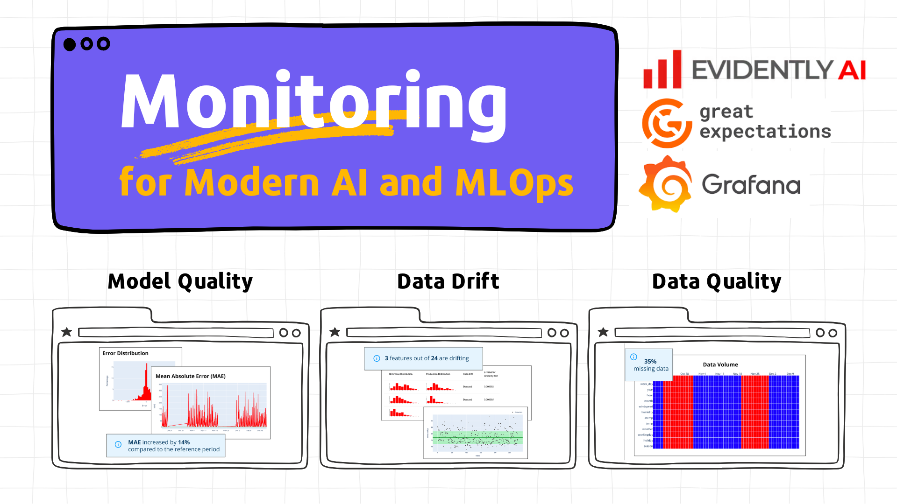
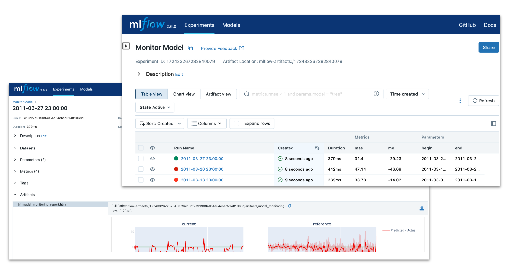
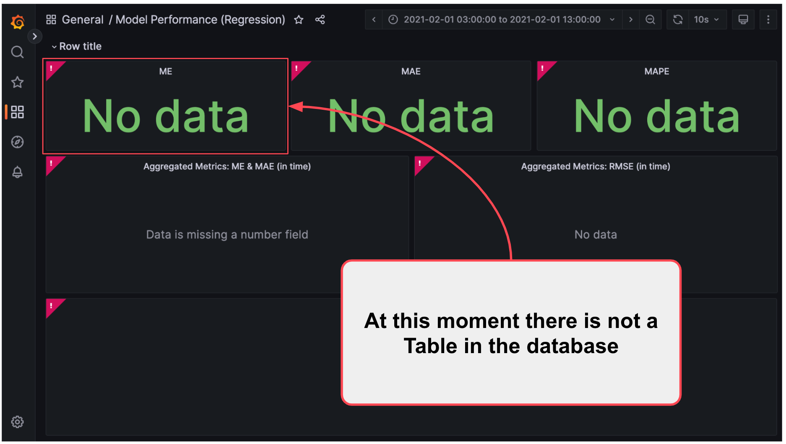
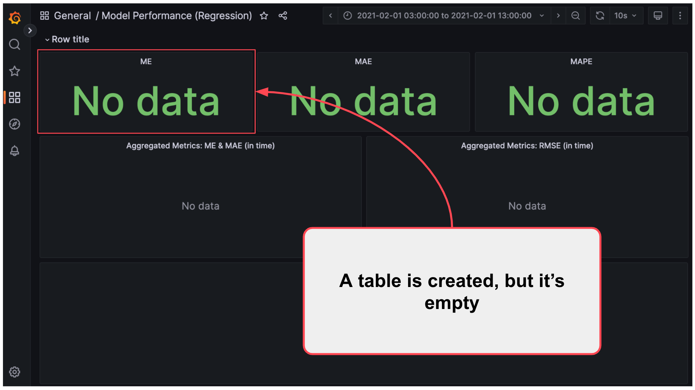
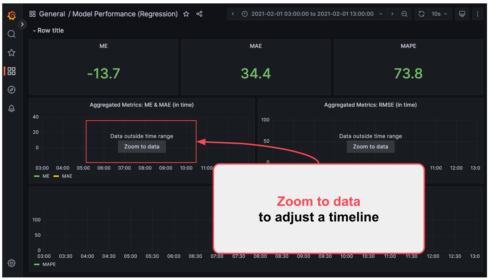
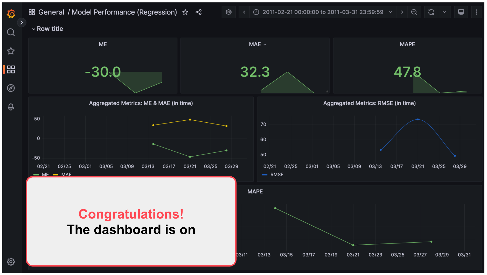
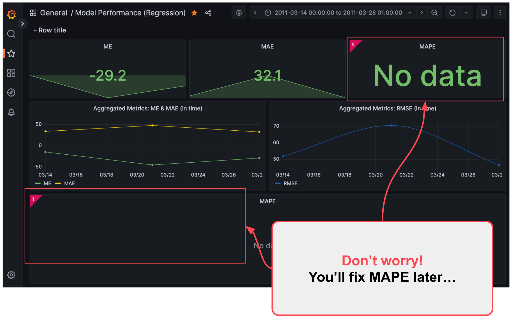
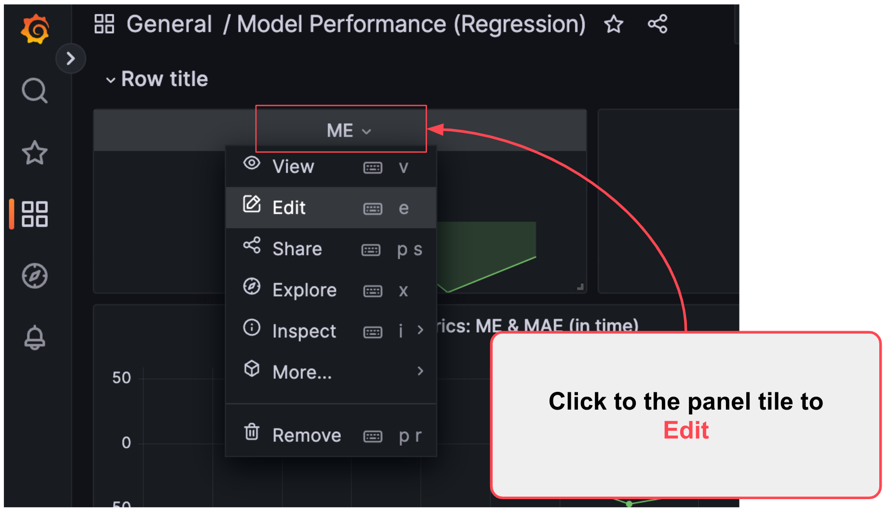
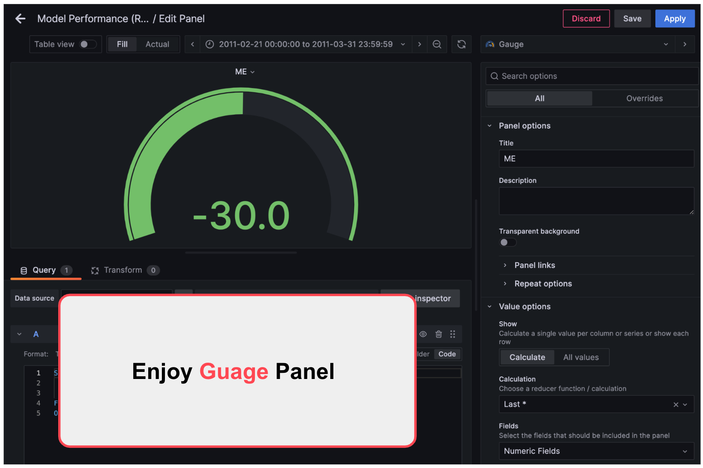

# 🚀 Tutorial: Monitoring for Modern AI and MLOps

## 👀 Overview

🎓 **What is this?** Welcome to "Comprehensive ML Monitoring for Modern AI and MLOps." This tutorial is your guide to navigating the critical world of monitoring ML models and data. We'll explore key concepts and introduce popular open-source tools: **Evidently AI**, **MLflow**, and **Grafana**.

👩‍💻 **Who is this tutorial for?** If you're a Data Scientist, AI Developer, or ML Engineer aiming to build robust and reliable machine learning systems, this tutorial is for you. We'll cover foundational principles and practical applications.

🎯 **What will you learn in this tutorial?**

- The essential tasks and strategies for effective ML monitoring in an MLOps context, including different monitoring layers and paradigms.
- Setting up model performance and data quality monitoring with Evidently AI (using its modern API).
- Visualizing crucial monitoring metrics with Grafana dashboards.
- Integrating monitoring insights with MLOps tools like MLflow, including tracking model performance over time.

🔍 **How is it structured?** Through clear, step-by-step instructions with illustrative code examples (provided in accompanying notebooks) in Markdown format.

⏱️ **How much time will it take?** Approximately **60-90 minutes** to cover the concepts and tool introductions, with additional time if you run all code examples thoroughly.

---

## 📖 Table of Contents

- [🚀 Tutorial: Comprehensive ML Monitoring for Modern AI and MLOps](#-tutorial-comprehensive-ml-monitoring-for-modern-ai-and-mlops)
  - [👀 Overview](#-overview)
  - [📖 Table of Contents](#-table-of-contents)
  - [⚙️ 1 - Prerequisites & Installation](#️-1---prerequisites--installation)
- [🛠️ 2 - ML Monitoring: Core Tasks and Tools in MLOps](#️-2---ml-monitoring-core-tasks-and-tools-in-mlops)
  - [Essential Monitoring Layers in ML Systems](#essential-monitoring-layers-in-ml-systems)
  - [Monitoring Paradigms: Batch vs. Online](#monitoring-paradigms-batch-vs-online)
  - [Beyond Tabular Data: Monitoring Other AI Systems](#beyond-tabular-data-monitoring-other-ai-systems)
  - [Popular Open-Source Tools for ML Monitoring](#popular-open-source-tools-for-ml-monitoring-1)
- [🏎️ 3 - Evidently AI: Generating Model & Data Quality Insights (using the modern API)](#️-3---evidently-ai-generating-model--data-quality-insights-using-the-modern-api)
  - [A Note on Evidently AI API Changes](#a-note-on-evidently-ai-api-changes)
  - [Step 1: Import Evidently AI and Dependencies](#step-1-import-evidently-ai-and-dependencies-1)
  - [Step 2: Prepare Your Data (Reference vs. Current)](#step-2-prepare-your-data-reference-vs-current-1)
  - [Step 3: Generate Data Drift Reports](#step-3-generate-data-drift-reports-1)
  - [Step 4: Generate Custom Reports](#step-4-generate-custom-reports)
  - [Step 5: Customize and Save Reports](#step-5-customize-and-save-reports)
- [🤝 4 - Integrating Evidently AI with MLflow for Model Performance Monitoring (Weekly Comparison)](#-4---integrating-evidently-ai-with-mlflow-for-model-performance-monitoring-weekly-comparison)
  - [Step 1: Load Data](#step-1-load-data-2)
  - [Step 2: Define Data Structure (Column Mapping)](#step-2-define-data-structure-column-mapping-1)
  - [Step 3: Train a Simple Model](#step-3-train-a-simple-model-1)
  - [Step 4: Prepare Reference Dataset](#step-4-prepare-reference-dataset-1)
  - [Step 5: Prepare Current Dataset (Example Batch)](#step-5-prepare-current-dataset-example-batch)
  - [Step 6: Generate a Model Quality Report with Evidently AI](#step-6-generate-a-model-quality-report-with-evidently-ai-1)
  - [Step 7: Extract Key Metrics from the Evidently AI Report](#step-7-extract-key-metrics-from-the-evidently-ai-report-1)
  - [Step 8: Log Reports and Metrics to MLflow (Weekly Batches)](#step-8-log-reports-and-metrics-to-mlflow-weekly-batches)
- [📊 5 - Visualizing ML Metrics with Grafana and PostgreSQL](#-6---visualizing-ml-metrics-with-grafana-and-postgresql-1)
  - [Step 1: Launch Grafana and PostgreSQL](#step-1-launch-grafana-and-postgresql-1)
  - [Step 2: Calculate Monitoring Metrics (Using Evidently AI)](#step-2-calculate-monitoring-metrics-using-evidently-ai-1)
  - [Step 3: Prepare the PostgreSQL Monitoring Database](#step-3-prepare-the-postgresql-monitoring-database-1)
  - [Step 4: Log Model Quality Metrics to PostgreSQL](#step-4-log-model-quality-metrics-to-postgresql-1)
  - [Step 5: Explore the Pre-configured Grafana Dashboard](#step-5-explore-the-pre-configured-grafana-dashboard-1)
  - [Step 6: Customize Grafana Panels (Exercise)](#step-6-customize-grafana-panels-exercise-1)
- [🔗 6 - Additional Resources](#-7---additional-resources-1)
- [🎉 7 - Next Steps & Conclusion](#-8---next-steps--conclusion-1)

---

## ⚙️ 1 - Prerequisites & Installation

Before you start with ML monitoring, make sure your development environment is ready with Python, the necessary tools, and the project code.

**Prerequisites:**

- **Python 3.9+** installed.
- **uv** (a fast, modern Python package manager) installed.
  - If you don't have `uv`, install it with: `pip install uv` or `pipx install uv`. See the [official `uv` documentation](https://github.com/astral-sh/uv) for more options.
- **Git** installed (for cloning the project repository).
- **Docker** and **Docker Compose** installed (for running monitoring infrastructure).
- Basic understanding of Python, pandas, and machine learning concepts.
- Familiarity with the command line/terminal.

> 💡 **Project Structure:** This tutorial assumes a project structure with `data/`, `src/`, `notebooks/` directories at the project root.

**Setup Instructions:**

For detailed, step-by-step instructions on how to:

1. Clone the project repository,
2. Create a Python virtual environment using `uv`, and
3. Install all required dependencies,

please refer to the **[👩‍💻 Quick Start: Installation & Setup section in the project's README.md file](README.md#️-quick-start-installation--setup)**.

Once you have completed the setup steps in the `README.md`, your environment will be ready for the hands-on ML monitoring tutorial.

---

## 🛠️ 2 - ML Monitoring: Core Tasks and Concepts in MLOps

Effective ML monitoring is a cornerstone of robust MLOps practices, ensuring models perform reliably and deliver value over time. It's the continuous process of observing, tracking, and analyzing the performance, behavior, and data of ML systems in production.

### Essential Monitoring Layers in ML Systems (General)

Monitoring an ML system involves observing several interconnected layers, crucial for any type of ML model:

1.  **🖥️ System Health & Performance:**
    *   *Focus:* Backend infrastructure, API responsiveness.
    *   *Metrics:* Prediction service latency, throughput, error rates, uptime, resource (CPU/memory/GPU) usage.
2.  **💾 Data Integrity & Quality:**
    *   *Focus:* Validity and statistical properties of input data for inference and retraining.
    *   *Key Concerns:* **Data Drift** (changes in feature distributions), schema violations, missing values, outliers.
    *   *MLOps Link:* Data issues often trigger alerts for data pipeline reviews or retraining. Feature Stores can help maintain consistency.
3.  **🧠 ML Model Performance:**
    *   *Focus:* The model's predictive power and behavior in production.
    *   *Key Concerns:* **Prediction Drift** (changes in output distribution), **Concept Drift** (changes in feature-target relationships), degradation of accuracy metrics (e.g., F1, MAE), model staleness, fairness, and bias.
    *   *MLOps Link:* Performance drops often initiate automated retraining workflows or investigation into data changes.
4.  **📈 Business or Product KPIs:**
    *   *Focus:* The model's impact on overarching business objectives.
    *   *Metrics:* Click-through rates, conversion, revenue impact, user engagement, operational efficiency gains.
    *   *MLOps Link:* Demonstrates the ROI of ML initiatives and guides strategic decisions.


>*Source: [Evidently AI Blog - ML Monitoring Metrics](https://www.evidentlyai.com/blog/ml-monitoring-metrics)*

These layers are not isolated. For example, a drop in a business KPI (Layer 4) might be traced back to model performance degradation (Layer 3), caused by data drift (Layer 2), due to an issue in a data ingestion service (Layer 1). This holistic view is central to **ML Observability**, providing deeper insights into *why* issues occur, not just *that* they occurred.

### Monitoring for Modern AI Applications (LLMs, Agents, RAGs)

While the layers above apply to all ML, "Modern AI" applications like Large Language Models (LLMs), Autonomous Agents, and Retrieval-Augmented Generation (RAG) systems introduce specific monitoring challenges and metrics due to their complexity, non-deterministic nature, and handling of unstructured data.

*   **Data Integrity & Quality:** Beyond tabular feature drift, monitoring involves:
    *   **Prompt/Query Characteristics:** Drift in prompt length, style, complexity, or topics.
    *   **Bias Detection:** Identifying potential biases in input prompts or external data sources.
    *   **Context Relevance (RAG):** Ensuring retrieved documents are relevant, fresh, and high-quality.
    *   **Unstructured Data Issues:** Monitoring quality of text data, documents, or other unstructured inputs. This often involves analyzing text properties or embeddings.
*   **AI Model Performance:** Traditional metrics are often insufficient. Key concerns and metrics include:
    *   **Generation Quality:** Fluency, coherence, factual consistency (especially for RAG), toxicity, style drift.
    *   **Hallucination Rate:** Tracking how often the model generates factually incorrect or nonsensical information.
    *   **Task Success (Agents):** Measuring if the agent successfully completes multi-step instructions.
    *   **Efficiency & Cost:** Monitoring token usage, API call volume, and computational costs.
    *   **Bias in Outputs:** Detecting if generated text or agent actions exhibit unfair biases.
    *   **Evaluation:** Often relies on subjective human evaluation, LLM-as-a-judge techniques, or specialized benchmarks. Quantitative metrics like Perplexity, BLEU, ROUGE, and specialized RAG metrics (Context Relevance, Groundedness, Answer Relevance) are also used.
*   **ML Observability:** Gaining insight into the step-by-step execution of Agents or the retrieval and generation process in RAG is crucial for debugging and understanding behavior. Tracing the flow of data and control through complex pipelines is key.

### Monitoring Paradigms: Batch vs. Online

ML monitoring can be implemented using different paradigms depending on the application's needs and the availability of data/labels:

*   **Batch Monitoring:** This is suitable for systems where predictions are generated in batches (e.g., daily reports, weekly recommendations) or when ground truth labels are available with a delay. Monitoring checks are run periodically on collected data chunks. This approach is versatile and often simpler to implement.
*   **Online (Real-time) Monitoring:** This is necessary for low-latency, real-time prediction services (e.g., fraud detection, personalized recommendations). Metrics are computed continuously or near real-time from live request/response data streams. This requires more sophisticated infrastructure for data ingestion and processing.

Understanding the appropriate paradigm is crucial for designing the monitoring system.

Okay, I'll fix the formatting to combine all rows into a single table and correct the "Covered Here?" status for Great Expectations.

### Popular Open-Source Tools for ML Monitoring

Monitoring in MLOps utilizes various open-source tools, each often specializing in different layers or aspects of the ML system. While many foundational tools apply broadly, some are gaining prominence for modern AI applications like LLMs, Agents, and RAGs.

Here's an overview of popular tools, including those covered in this tutorial:

| Tool                   | Primary Focus / Use Case                          | Relevance to Modern AI / LLMs & GenAI                                 | Covered Here? |
| :--------------------- | :------------------------------------------------ | :-------------------------------------------------------------------- | :------------ |
| **Evidently AI**       | Data & Model Drift, Performance Reports           | Text & Embedding Drift, LLM Evaluation Metrics (via custom). Visual reports. | **Yes**       |
| **Grafana**            | Time-Series Visualization & Dashboarding          | Visualize *any* ML metric over time (Drift, Performance, Cost, etc.)    | **Yes**       |
| **MLflow**             | ML Lifecycle (Tracking, Logging, Registry)        | Log monitoring results (reports, metrics), model artifacts. Historical view. | **Yes**       |
| **whylogs**            | Data Profiling & Statistical Monitoring           | Profile Text/Embeddings, generate statistical summaries, detect drift. | No            |
| **Phoenix (by Arize)** | LLM Application Observability & Evaluation        | RAG/Agent tracing, LLM generation evaluation (factuality, etc.). UI for analysis. | No            |
| **OpenTelemetry**      | Application Instrumentation & Tracing             | Instrumental for tracing multi-step Agent/RAG pipeline execution.   | No            |
| **Great Expectations** | Data Validation & Quality Assertions ("Expectations") | Input/Output Schema validation, basic text properties. Batch checks.    | **Yes**       |

---

## 🏎️ 3 - Evidently AI: Generating Model & Data Quality Insights (using the modern API)

**Evidently AI** calculates a wide array of metrics for data and ML models, presenting them in interactive HTML reports or JSON snapshots. This is invaluable for debugging, validation, and ongoing monitoring. Evidently supports tabular data, text, and embeddings. [12, 18, 23]

<!--  -->


### Step 1: Evidently AI for ML Monitoring

> 💡 **Open the example notebook:** `notebooks/1-evidently-getting-started.ipynbb`

- tabular data 
- metrics and reports calculation 

### Step 2: Incorporate into Monitoring Job


### Step 3: Create Custom Reports

You can add any combination of metrics to a report.

```python
custom_report = Report(metrics=[
    ColumnSummaryMetric(column_name='AveRooms'),
    ColumnQuantileMetric(column_name='AveRooms', quantile=0.25),
    ColumnDriftMetric(column_name='AveRooms')
])

custom_report.run(reference_data=reference_df, current_data=current_df, column_mapping=column_mapping)
custom_report.show(mode='inline')
```


> 💡 For more examples of metrics and reports, see the [Official Evidently AI Documentation](https://docs.evidentlyai.com/get-started/tutorial#4.-get-the-data-drift-report) and explore the various `evidently.metrics` classes. [3, 18]

### Step 5: Save Reports

You can export reports as:

```python
report_dict = custom_report.as_dict()
custom_report.save_html("custom_averooms_report.html")
# data_drift_report.save_json("data_drift_snapshot.json") # For Evidently Monitoring UI
```

> ℹ️ **Monitoring as Code:** Configurations for Evidently AI reports can be version-controlled, aligning with "Monitoring as Code" MLOps principles.

---

## 🤝 4 - Integrating Evidently AI with MLflow for Model Performance Monitoring 

> 💡 **Open the example notebook:** `notebooks/2-monitor-model-evidently-mlflow.ipynb`

Log Evidently AI reports and extracted metrics to MLflow to track model quality over time alongside your experiments. This section demonstrates monitoring model performance on a weekly basis using a regression example.

### Step 1: Run a MLflow Tracking Server

> Use MLflow 3+ API 


### Step 2: Calculate metrics and reports with Evidently AI

### Step 3: Log metrics to MLflow

Accessing metrics from a report using  `.dict()`  method.

```python
mlflow.log_metrics(report.dict())
```

> Note: The exact structure of the dictionary returned by `.dict()` can evolve with Evidently AI versions. Always refer to the [official documentation](https://docs.evidentlyai.com/reference/report) or inspect the `.dict()` output for the version you are using to ensure correct metric extraction.

### Step 4: Log Reports to MLflow

This loop demonstrates processing and monitoring data week by week, logging the results to MLflow for tracking model performance trends over time.

```python

mlflow.set_experiment("Bike Sharing Model Monitoring")

# add report to mlflow example
```

<!-- UPDATE IMAGE  -->


> 💡 **MLOps Loop:** This batch monitoring is a key component of an MLOps loop. Significant drift or performance degradation logged here could trigger automated alerts or even a model retraining pipeline.

---

## 📊 5 - Visualizing ML Metrics with Grafana and PostgreSQL

> 💡 **Open the example notebook:** `notebooks/4-monitor-model-with-grafana.ipynb`

Use Grafana to create dashboards for ML metrics stored in PostgreSQL. This allows visualizing trends in model performance and data drift over time.

### Step 1: Launch Grafana and PostgreSQL

(Docker Compose instructions and Grafana login remain the same)

```bash
docker compose up -d
```




### Step 2: Calculate Monitoring Metrics (Using Evidently AI)

(Reference to the notebook and the metric extraction function `get_model_monitoring_metrics_for_grafana` remains. This function would extract metrics from Evidently AI reports suitable for time-series storage.)

### Step 3: Prepare the PostgreSQL Monitoring Database

(Reference to the accompanying notebook (`4-monitor-model-with-grafana.ipynb`) which contains the SQLAlchemy definition for the `model_performance` table and likely calls a utility function (e.g., from `src/db_utils.py`) like `create_db()` to establish this table in your PostgreSQL database.)


### Step 4: Log Model Quality Metrics to PostgreSQL

(The conceptual loop logging metrics to PostgreSQL table `model_performance` remains. The actual code in the notebook would take the metrics extracted from Evidently AI (as in Section 4, Step 7) and insert them into the PostgreSQL database with a timestamp.)



> 💡 **Online Monitoring Context:** For real-time APIs, metrics would be computed from logged request/response data, often asynchronously, and fed into a similar time-series database for Grafana. [2, 33, 34]

### Step 5: Explore the Pre-configured Grafana Dashboard

(Instructions for editing panels, changing visualization to Gauge, modifying queries, and using suggestions remain the same conceptually; detailed steps are in the notebook.)



### Step 6: Customize Grafana Panels (Exercise)

(The exercise to add MAPE to the dashboard, by uncommenting code in the notebook and updating Grafana, remains).

> 🎨 **Dashboard as Code:** Grafana dashboards can be defined as JSON and provisioned automatically, aligning with MLOps "Infrastructure/Dashboard as Code" principles.

---

## 🔗 7 - Additional Resources

- [Evidently AI Official Documentation](https://docs.evidentlyai.com/)
- [Evidently AI Blog: Monitoring ML systems in production](https://www.evidentlyai.com/blog/ml-monitoring-metrics)
- [Evidently AI Blog: Batch ML monitoring blueprint](https://www.evidentlyai.com/blog/batch-ml-monitoring-architecture)
- **Evidently AI LLM/NLP/RAG Monitoring:**
  - [Evidently AI Documentation on LLM Evaluation and Monitoring](https://docs.evidentlyai.com/get-started/tutorial-llm) [27]
  - [Evidently AI Community Examples for LLM/Text](https://github.com/evidentlyai/community-examples/tree/main/examples/llm_text_descriptors) [29]
  - [Evidently AI YouTube Tutorial on LLM Evaluation](https://www.youtube.com/watch?v=s_gg3qW4JcQ) [27]
  - [Evidently AI YouTube Tutorial on Drift Monitoring for LLM Apps](https://www.youtube.com/watch?v=2d3-wD7w1wA) [28]
- [Great Expectations Official Documentation](https://docs.greatexpectations.io/docs/oss/tutorials/quickstart) [7]
- [Great Expectations Blog: Why data quality is key to MLOps](https://greatexpectations.io/blog/ml-ops-data-quality)
- [Grafana Documentation](https://grafana.com/docs/grafana/latest/)
- [MLflow Documentation](https://mlflow.org/docs/latest/index.html)

---

## 🎉 8 - Next Steps & Conclusion

Congratulations on completing this tutorial on ML monitoring! You've explored key tools like Evidently AI, Great Expectations, MLflow, and Grafana, vital for robust MLOps. You've learned about different monitoring layers, understood the difference between batch and online monitoring, and seen how to track tabular model performance over time.

**Where to go from here?**

ML monitoring is a dynamic and critical field in MLOps. Continuous learning and adapting these tools will be key to building trustworthy and reliable AI systems. Consider exploring:

- 📊 **Evidently AI Tests & Test Suites:** Beyond reports, explore using Evidently AI `Tests` and `TestSuites` for programmatic assertions on data and model metrics, enabling automated checks in CI/CD pipelines.
- 🔄 **Online/Real-time Monitoring Implementation:** Investigate architectures and tools needed to implement online monitoring for low-latency inference services, contrasting it further with the batch examples covered here. [2, 33, 34, 40]
- 📈 **Monitoring Other Data Types:** Dive deeper into monitoring methodologies and metrics for non-tabular data, such as text, images, and embeddings, including tools like Evidently AI's specific metrics for these data types. [2, 18, 37, 41, 43, 44]
- 🚨 **Anomaly Detection:** Learn how to apply anomaly detection techniques directly to your monitoring metrics (e.g., sudden spikes in error rates, unexpected drops in throughput) to set up more intelligent alerting. [8, 10, 31, 35, 36]
- ⚖️ **Explainability & Fairness Monitoring:** Extend monitoring to track metrics related to model explainability (understanding *why* a model made a prediction) and fairness (identifying and mitigating bias in predictions across different groups).
- 💰 **Cost Monitoring:** Integrate monitoring of computational resources (CPU, GPU, memory) and cloud service costs associated with your ML inference and monitoring infrastructure. [17, 24, 25, 32]
- 🔗 **Data Pipeline Monitoring:** Expand your focus upstream to monitor the health, performance, and data quality of the ETL/ELT pipelines that prepare data for your ML models. Great Expectations is a part of this, but consider pipeline orchestration tool monitoring too.
- 🔬 **ML Observability Platforms:** Investigate dedicated commercial or advanced open-source platforms (like Arize, Fiddler, WhyLabs, Aporia, Evidently Cloud) that offer integrated ML observability capabilities, often including real-time monitoring, sophisticated alerting, and debugging tools. [5, 7, 12, 15, 23]
- ☁️ **Cloud-Native Monitoring:** Explore the monitoring services offered by major cloud providers (AWS SageMaker Model Monitor, GCP Vertex AI Model Monitoring, Azure ML Model Monitoring) if you are working within a specific cloud ecosystem. [9, 11, 13, 20, 21]
- ⚙️ **Automate with Orchestrators:** Integrate monitoring jobs (like running Evidently reports or GX checkpoints) into MLOps pipelines using orchestrators like Airflow, Kubeflow, or Prefect.
- 🔔 **Advanced Alerting:** Set up sophisticated alerts in Grafana or via custom scripts triggered by monitoring results, routing notifications to the appropriate teams. [14, 16, 19, 22]

Armed with the knowledge from this tutorial and a path forward for deeper exploration, you are well-equipped to build and maintain robust and reliable AI systems in a modern MLOps environment.


[⬆️ Back to Table of Contents](#-table-of-contents)

```
